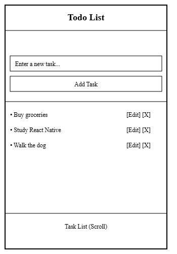

## Objectives
- Exploring React Native Core Components
-  Working with State Management and Hooks
## React Native Core Components
React Native provides a set of core components that simplify the process of building mobile application interfaces. Each component has a specific purpose and helps developers structure and display content efficiently.   
In the previous workshop, we explored some basic components such as Text, View, and Button. However, the framework includes many more components that allow developers to create complex and interactive user interfaces.  
### View
The View component is one of the most fundamental components in React Native. It acts as a container that supports layout with Flexbox, styling, and handling touch events. In many ways, it is similar to a `<div>` element in web development.  
Developers use the `View` component to group other components together and control how they are arranged on the screen.
```tsx
import React from "react";  
import { View, Text } from "react-native";  
  
export default function App() {  
  return (  
    <View>  
      <Text>Hello World</Text>  
    </View>  
  );  
}
```
#### Styling a View
The `View` component can be styled using the `style` prop, which allows us to control layout, spacing, colors, and more.
```tsx
<View  
  style={{  
    backgroundColor: "lightblue",  
    padding: 20,  
    margin: 10,  
  }}  
>  
  <Text>Styled View</Text>  
</View>
```
### Text
The Text component is used to display text in a React Native application, all texts must be wrapped inside a `Text` component.   
The `Text` component supports styling, nesting, and touch handling, making it flexible for displaying titles, paragraphs, labels, and other textual content in the app.
```Tsx
import React from "react";  
import { View, Text } from "react-native";  
  
export default function App() {  
  return (  
    <View>  
      <Text>Hello World</Text>  
    </View>  
  );  
}
```
#### Styling Text
Same as the `View `, the `Text` component can be styled using the `style` prop to control properties such as font size, color, alignment, and weight.
```tsx
<Text  
  style={{  
    fontSize: 20,  
    color: "blue",  
    fontWeight: "bold",  
  }}  
>  
  Styled Text  
</Text>
```
#### Nesting Text
React Native also allows nesting `Text` components to apply different styles within the same sentence.
```tsx
<Text>  
  This is normal text and{" "}  
  <Text style={{ fontWeight: "bold" }}>this part is bold</Text>.  
</Text>
```
### Button
Apps need to handle user interactions and clicks, and buttons are one of the most common ways to do that. In React Native, the Button component provides a simple way to trigger actions when the user presses it.   
A button usually performs an action such as submitting a form, navigating to another screen, or triggering a function in the app.

To create a button, we mainly use two props:
- **title** the text displayed on the button
- **onPress** the function executed when the button is pressed
```tsx
import React from "react";  
import { View, Button } from "react-native";  
  
export default function App() {  
  return (  
    <View>  
      <Button  
        title="Press Me"  
        onPress={() => console.log("Button pressed")}  
      />  
    </View>  
  );  
}
```
The `Button` component also accepts a few additional props to modify its behavior:
- **color** changes the button color
- **disabled** prevents the button from being pressed
```tsx
<Button  
  title="Submit"  
  color="green"  
  onPress={() => console.log("Form submitted")}  
  disabled={false}  
/>
```
### TextInput
Many mobile applications need to collect information from users, such as names, emails, passwords, or search queries. In React Native, the TextInput component is used to allow users to enter and edit text.  
A simple `TextInput` can be created by importing it from `react-native` and placing it inside a `View`.
```tsx
import React from "react";  
import { View, TextInput } from "react-native";  
  
export default function App() {  
  return (  
    <View>  
      <TextInput placeholder="Enter your name" />  
    </View>  
  );  
}
```
#### Styling a TextInput
Just like other components, `TextInput` can be styled using the `style` prop.
```tsx
<TextInput  
  placeholder="Enter your email"  
  style={{  
    borderWidth: 1,  
    borderColor: "gray",  
    padding: 10,  
    margin: 10,  
    borderRadius: 5,  
  }}  
/>
```
Here we adding a border, padding, and spacing to make the input field more visually clear.
#### Handling User Input
To work with the text entered by the user, we typically store it in a state variable and update it whenever the text changes.
```tsx
import React, { useState } from "react";  
import { View, TextInput, Text } from "react-native";  
  
export default function App() {  
  const [name, setName] = useState("");  
  
  return (  
    <View>  
	  <Text
	  style={{  fontSize: 20,  fontWeight: "bold",margin: 10,  }} 
	  >Your Name is: {name} </Text>
      <TextInput  
        placeholder="Enter your name"  
        value={name}  
        onChangeText={setName}
        style={{  borderWidth: 1,  borderColor: "gray",  padding: 10,  margin: 10,  borderRadius: 5,  
  }}   
      />  
    </View>  
  );  
}
```
The `onChangeText` prop updates the `name` state whenever the user types in the input field.
### Image
React Native provides the Image component to render images such as icons, photos, logos, and illustrations inside the app, Images can come from different sources, such as local files inside the project or remote URLs from the internet.      
A basic `Image` component requires at least the ``source`` of the image and usually a style to define its size.
```tsx
import React from "react";  
import { View, Image } from "react-native";  
  
export default function App() {  
  return (  
    <View>  
      <Image  
        source={{ uri: "https://reactnative.dev/img/tiny_logo.png" }}  
        style={{ width: 50, height: 50 ,margin:20}}  
      />  
    </View>  
  );  
}
```
Here, we use the `uri` property to load an image from an online URL. If we want to display an image from local storage or from our file system, we use the `require` function. For example, we can create an **assets** folder, place our images and illustrations there, and then load them into the app using `require`.
```Tsx
<Image  
  source={require("./assets/logo.png")}  
  style={{ width: 100, height: 100 }}  
/>
```
Using local images is common for icons, logos, and static assets included with the application.
### FlatList
Mobile apps often need to display **lists of data**, such as messages, products, contacts, or posts. React Native provides the FlatList component to efficiently render long lists of items.    
We can render a list of elements using `map()`, but this approach renders all items at once. `FlatList` solves this problem by rendering only the items that are currently visible on the screen, which helps keep the app fast and efficient even when working with large datasets.

To use `FlatList`, we typically provide three main props:
- data the array of items to display
- renderItem a function that defines how each item should appear
- keyExtractor a function that provides a unique key for each item
```tsx
import React from "react";  
import { View, Text, FlatList } from "react-native";  
  
export default function App() {  
  const fruits = ["Apple", "Banana", "Orange", "Mango"];  
  
  return (  
    <View style ={{margin:20}}>  
      <FlatList  
        data={fruits}  
        keyExtractor={(item, index) => index.toString()}  
        renderItem={({ item }) =>  
         <View style={{ margin: 5, padding: 10, backgroundColor: '#eee' }}>
		    <Text>{item}</Text>
		 </View>
		}  
      />  
    </View>  
  );  
}
```
### SectionList
Sometimes data needs to be organized into groups or sections rather than a single list. For example, a contact list grouped by the first letter of names, or a shopping list grouped by category.   
React Native provides the SectionList component for this purpose. It works similarly to `FlatList`, but it allows items to be divided into sections with headers.

A `SectionList` mainly requires:
- sections an array of section objects
- renderItem defines how each item is displayed
- renderSectionHeader  defines how each section header appears

In the array of section objects. Each section object must contain a **`data`** property, which is an array of items for that section, and can also include other properties like `title` for the section header. 
```tsx
import React from "react";  
import { View, Text, SectionList } from "react-native";  
  
export default function App() {  
  const data = [  
    { title: "Fruits", data: ["Apple", "Banana", "Orange"] },  
    { title: "Vegetables", data: ["Carrot", "Tomato", "Potato"] },  
  ];  
  
  return (  
    <View style = {{margin:20}} >  
      <SectionList  
        sections={data}  
        keyExtractor={(item, index) => index.toString()}  
        renderItem={({ item }) =>
	        <View style={{ margin: 5, padding: 10, backgroundColor: '#eee' }}>
		      <Text>{item}</Text>
		     </View>
		}  
        renderSectionHeader={({ section }) => (  
          <Text style={{ fontWeight: 'bold', fontSize: 16, marginVertical: 5 }}>{section.title}</Text>  
        )}  
      />  
    </View>  
  );  
}
```
In this example, items are grouped into two sections: Fruits and Vegetables, each with its own header.   
If the array of section objects isn’t formatted correctly, we can use the `SECTIONS.map()` function to extract the data from the list and transform it to follow the `SectionList` format.
```tsx
<SectionList  
	sections={SECTIONS.map(data => ({  
		title: section.title,  
		data: section.noteData,  
	}))}  
	keyExtractor={(item, index) => index.toString()}  
	renderItem={({ item }) => <Text>{item}</Text>}  
	renderSectionHeader={({ section }) => <Text>{section.title}</Text>}  
/>
```

### ScrollView
The `View` component good at grouping elements but it have small problem, when our app content exceeds the screen size it .... to ssolve this we use `ScrollView`, the **ScrollView** component allows us to create a scrollable container that can hold multiple components, including `View`, `Text`, `Image`, and even lists.   
Unlike `FlatList`, which is optimized for large datasets, `ScrollView` renders **all its children at once**, so it’s best suited for smaller or medium-sized content.

```tsx
import React from 'react';
import { ScrollView, View, Text, Image, Button } from 'react-native';

export default function App() {

  return (
    <ScrollView style={{ flex: 1, backgroundColor: '#fff', padding: 15 }}>
      <View style={{ marginBottom: 20 }}>
        <Text style={{ fontSize: 28, fontWeight: 'bold' }}>Explore Cats World</Text>

        <Text style={{ fontSize: 16, color: '#666', marginTop: 5 }}>
          Discover cute cats, fun facts, and more!
        </Text>
      </View>

      <Image
        source={{ uri: 'https://picsum.photos/600/300?random=1' }}
        style={{ width: '100%', height: 300, borderRadius: 15, marginBottom: 25 }}
      />

      <View style={{ marginBottom: 25 }}>
        <Text style={{ fontSize: 22, fontWeight: '600', marginBottom: 10 }}>About Cats</Text>
        <Text style={{ fontSize: 16, lineHeight: 24, color: '#333' }}>
          Cats are fascinating creatures, known for their agility, playfulness, and independence.
          They have been companions to humans for thousands of years.
        </Text>
      </View>
      
      <View style={{ marginBottom: 25 }}>
        <Text style={{ fontSize: 22, fontWeight: '600', marginBottom: 15 }}>Popular Breeds</Text>
        <View style={{
          backgroundColor: '#f9f9f9',
          borderRadius: 15,
          padding: 15,
          marginBottom: 15,
          shadowColor: '#000',
          shadowOpacity: 0.1,
          shadowOffset: { width: 0, height: 2 },
          shadowRadius: 5,
        }}>

          <Image
            source={{ uri: 'https://picsum.photos/400/200?random=2' }}
            style={{ width: '100%', height: 200, borderRadius: 10, marginBottom: 10 }}
          />
          <Text style={{ fontSize: 18, fontWeight: '500', marginBottom: 5 }}>Persian Cat</Text>
          <Text style={{ fontSize: 14, color: '#555' }}>
            Persian cats are known for their long hair, calm personality, and cute round face.
          </Text>
        </View>

        <View style={{
          backgroundColor: '#f9f9f9',
          borderRadius: 15,
          padding: 15,
          marginBottom: 15,
          shadowColor: '#000',
          shadowOpacity: 0.1,
          shadowOffset: { width: 0, height: 2 },
          shadowRadius: 5,
        }}>
          <Image
            source={{ uri: 'https://picsum.photos/401/200?random=3s' }}
            style={{ width: '100%', height: 200, borderRadius: 10, marginBottom: 10 }}
          />
          <Text style={{ fontSize: 18, fontWeight: '500', marginBottom: 5 }}>Siamese Cat</Text>
          <Text style={{ fontSize: 14, color: '#555' }}>
            Siamese cats are social, vocal, and known for their striking color points and blue eyes.
          </Text>
        </View>
      </View>
      
      <Button  title ="Learn More" />
      
      <View style={{ paddingVertical: 20, borderTopWidth: 1, borderTopColor: '#ddd' }}>
        <Text style={{ textAlign: 'center', color: '#999' }}>© 2026 Cat World Inc.</Text>
      </View>
    </ScrollView>
  );
}
```
Here the content inside the `ScrollView` can be scrolled vertically if it exceeds the screen height.   
We can also enable horizontal scrolling by setting the horizontal prop to true.
```tsx
<ScrollView horizontal style={{ marginTop: 20 }}>  
  <View style={{ width: 100, height: 100, backgroundColor: "red", margin: 5 }} />  
  <View style={{ width: 100, height: 100, backgroundColor: "green", margin: 5 }} />  
  <View style={{ width: 100, height: 100, backgroundColor: "blue", margin: 5 }} />  
</ScrollView>
```
### Touchable and Pressable
Buttons are useful for simple actions, but in many apps, we need more control over how interactive elements look and behave. The built-in `Button` component in React Native is limited in styling we can change the color, but you cannot fully customize its size, shape, or animations.   
For these cases, React Native provides Touchable and Pressable components, which give more flexibility for creating interactive UI elements.
#### Touchable Components
React Native includes several Touchable components that respond to user touches:  
- **TouchableOpacity** Fades the element slightly when pressed
- **TouchableHighlight** Highlights the element with a color when pressed
- **TouchableWithoutFeedback** Detects touches without any visual feedback

These components allow us to wrap any view or text and make it interactive.
```tsx
import {useState} from "react";  
import { View, Text, TouchableOpacity} from "react-native";  

export default function App() {  
  const [counter,setCounter] = useState(0);
  return (  
    <View style={{ padding: 20 }}>  
     <Text style={{textAlign:"center", margin:10}}>{counter}</Text>
      <TouchableOpacity  
        onPress={() => setCounter(counter + 1)}  
        style={{  
          backgroundColor: "blue",  
          padding: 15,  
          borderRadius: 8,  
        }}  
      >  
        <Text style={{ color: "white", textAlign: "center" }}>Press Me</Text>  
      </TouchableOpacity>  
    </View>  
  );  
}
```
#### Pressable Component
React Native also introduces a newer, more flexible component called `Pressable`. It works like `Touchable` but offers **more advanced features**, such as detecting:
- Press in / press out
- Long press
- Hover (web) and focus states

`Pressable` is ideal for modern apps where we want animated feedback or conditional styling based on the press state.
```tsx
import {useState} from "react"; 
import { View, Text, Pressable } from "react-native";  
  
export default function App() {  
  const [counter,setCounter] = useState(0);
  return (  
    <View style={{ padding: 20 }}>  
      <Text style={{textAlign:"center", margin:10}}>{counter}</Text>
      <Pressable  
        onPress={() => setCounter(counter + 1)}  
        style={({ pressed }) => [  
          {  
            backgroundColor: pressed ? "darkblue" : "blue",  
            padding: 15,  
            borderRadius: 8,  
          },  
        ]}  
      >  
        <Text style={{ color: "white", textAlign: "center" }}>Press Me</Text>  
      </Pressable>  
    </View>  
  );  
}
```
Here, the `style` prop receives a function with the `pressed` parameter, allowing us to change the button color dynamically when the user presses it.
## State Management and Hooks
In React Native, apps are dynamic the user interacts with the interface, data changes, and the UI needs to update accordingly. To handle this, we use state.  
State represents the current data or values of a component that can change over time. When the state changes, React automatically re-renders the component to reflect the new values.     
To manage state and other React features inside functional components, we use special functions called **Hooks**.
### useState Hook
The `useState` hook is the most fundamental and commonly used hook in React Native. It allows us to declare a state variable inside a functional component and provides a way to update it.  
When calling `useState`, we pass the initial value of the state, and it returns an array containing two elements:
- **state variable** the current value
- **updater function** the function used to update the state
```tsx
const [stateVariable, setStateFunction] = useState(initialValue);
```
- `stateVariable`  holds the current state value
- `setStateFunction` updates the state and triggers a re-render
- `initialValue` the starting value of the state
```tsx
import { useState } from "react";  
import { View, Text, Button } from "react-native";  
  
export default function App() {  
  const [count, setCount] = useState(0);  
  return (  
    <View style={{ padding: 20, alignItems: "center" }}>  
      <Text style={{ fontSize: 24, marginBottom: 10 }}>Count: {count}</Text>  
      <Button  
        title="Increase"  
        onPress={() => setCount(count + 1)}  
      />  
    </View>  
  );  
}
```
The `useState` hook is not limited to numbers; it can store any JavaScript data type, including strings, booleans, arrays, and objects.
```tsx
const [name, setName] = useState("");  
const [isVisible, setIsVisible] = useState(false);  
const [fruits, setFruits] = useState(["Apple", "Banana"]);  
const [user, setUser] = useState({ name: "Alice", age: 25 });
```
### useReducer Hook
The `useReducer` hook is a more advanced state management tool in React Native. It is especially useful when our component state is complex, depends on previous state, or involves multiple sub-values.   
While `useState` works well for simple state updates, it can become cumbersome when we need to manage multiple related state variables or apply complex logic to update them. This is where `useReducer` shines. It allows us to centralize the state logic in a single reducer function.

The `useReducer` hook takes **two arguments**:
1. **reducer function** a function that determines how the state changes based on an action
2. **initial state** the starting value of the state

It returns an array with two elements:
- **state**  the current state value
- dispatch function a function used to send actions to the reducer
```tsx

const [state, dispatch] = useReducer(reducer, initialState);
```
- `state` holds the current state
- `dispatch(action)` sends an action to the reducer, which returns a new state
- `initialState` is the starting state of our component
#### Reducer Function
The reducer function defines how the state updates based on the action type:
```tsx
function reducer(state, action) {  
  switch (action.type) {  
    case "increment":  
      return { count: state.count + 1 };  
    case "decrement":  
      return { count: state.count - 1 };  
    case "reset":  
      return { count: 0 };  
    default:  
      return state;  
  }  
}
```
- `state` is the current state
- `action` is an object describing what happened (usually `{ type: "actionName" }`)
- The reducer returns a new state, which replaces the previous one

```tsx
import { View, Text, TouchableOpacity } from "react-native";    
import { useReducer } from "react";

const initialState = { count: 0 };  
function reducer(state, action) {  
  switch (action.type) {  
    case "increment":  
      return { count: state.count + 1 };  
    case "decrement":  
      return { count: state.count - 1 };  
    case "reset":  
      return { count: 0 };  
    default:  
      return state;  
  }  
}  

export default function App() {  
  const [state, dispatch] = useReducer(reducer, initialState);  
  return (  
    <View style={{ flex: 1, justifyContent: "center", alignItems: "center", backgroundColor: "#f2f2f2" }}>
      <Text style={{ fontSize: 32, fontWeight: "bold", marginBottom: 30 }}>Count: {state.count}</Text>
      
      <TouchableOpacity
        onPress={() => dispatch({ type: "increment" })}
        style={{ backgroundColor: "#4CAF50", padding: 15, borderRadius: 10, marginBottom: 10, width: 150, alignItems: "center" }}
      >
        <Text style={{ color: "white", fontSize: 18 }}>Increase</Text>
      </TouchableOpacity>
      
      <TouchableOpacity
        onPress={() => dispatch({ type: "decrement" })}
        style={{ backgroundColor: "#f44336", padding: 15, borderRadius: 10, marginBottom: 10, width: 150, alignItems: "center" }}
      >
        <Text style={{ color: "white", fontSize: 18 }}>Decrease</Text>
      </TouchableOpacity>

  

      <TouchableOpacity
        onPress={() => dispatch({ type: "reset" })}
        style={{ backgroundColor: "#2196F3", padding: 15, borderRadius: 10, width: 150, alignItems: "center" }}
      >
        <Text style={{ color: "white", fontSize: 18 }}>Reset</Text>
      </TouchableOpacity>
    </View>
  );  
}
```
### useEffect Hook
The `useEffect` hook is used in React Native to handle side effects inside functional components.  
Side effects are operations that happen after the component renders, such as fetching data from an API, starting timers, listening to events, or updating something when the state changes.   
While React Native components are mainly responsible for rendering the UI, sometimes we need to run additional logic after rendering.  
This is where `useEffect` becomes useful. It allows us to run code after the component updates or mounts, while keeping our component logic organized.

The `useEffect` hook takes two arguments:
1. effect function a function that contains the side effect logic
2. dependency array (optional) controls when the effect should run

It does not return state, unlike `useState` or `useReducer`.
```tsx
useEffect(effectFunction, dependencies);
```
- `effectFunction` contains the code that runs after render
- `dependencies` is an array that determines **when the effect runs**

The dependency array changes how `useEffect` behaves:
- No dependency array the effect runs after every render
```tsx
useEffect(() => {  
  console.log("Runs after every render");  
});
```
- Empty array `[]`  the effect runs only once when the component first loads
```tsx
useEffect(() => {  
  console.log("Runs only once when the component mounts");  
}, []);
```
- `[variable]` the effect runs only when `variable` changes
```tsx
useEffect(() => {  
  console.log("Runs whenever count changes");  
}, [variable]);

```
Let’s create a simple React Native app that converts **USD to EUR** to demonstrate how the `useEffect` hook works. The app will use three state variables: one to store the **amount in USD**, another to store the converted result, and a third that acts like a flag to trigger the conversion process.    
The app will include a TextInput so the user can enter the USD value, a Text component to display the converted result, and a TouchableOpacity button that starts the conversion. When the button is pressed, the flag state changes, which triggers the **`useEffect` hook**. Inside the effect, the app will fetch the latest exchange rate from an API, calculate the converted value, and update the result state so it appears on the screen.
```tsx
import { View, Text, TextInput, TouchableOpacity } from "react-native";
import { useState, useEffect } from "react";

export default function App() {
  const [amount, setAmount] = useState("");
  const [result, setResult] = useState("");
  const [convert, setConvert] = useState(false);
  
  const fetchRate = async () => {
      try {
        const res = await fetch("https://api.exchangerate-api.com/v4/latest/USD");
        const data = await res.json();
        const rate = data.rates.EUR;
        const converted = parseFloat(amount) * rate;
        setResult(converted.toFixed(2));
      } catch (error) {
        console.log("Error fetching data:", error);
      }
      setConvert(false);
    };

  useEffect(() => {
    if (!convert) return;
    fetchRate();
  }, [convert]);

  return (
    <View style={{ flex: 1, justifyContent: "center", alignItems: "center", backgroundColor: "#f2f2f2" }}>      
      <Text style={{ fontSize: 26, fontWeight: "bold", marginBottom: 20 }}>
        USD → EUR Converter
      </Text>
      <TextInput
        placeholder="Enter USD amount"
        value={amount}
        onChangeText={setAmount}
        keyboardType="numeric"
        style={{
          borderWidth: 1,
          borderColor: "#ccc",
          width: 200,
          padding: 10,
          marginBottom: 20,
          borderRadius: 8,
          backgroundColor: "white"
        }}
      />
      <TouchableOpacity
        onPress={() => setConvert(true)}
        style={{
          backgroundColor: "#4CAF50",
          padding: 15,
          borderRadius: 10,
          width: 150,
          alignItems: "center",
          marginBottom: 20
        }}
      >
        <Text style={{ color: "white", fontSize: 16 }}>Convert</Text>
      </TouchableOpacity>
      {result && (
        <Text style={{ fontSize: 22, fontWeight: "bold" }}>
          EUR: {result}
        </Text>
      )}
    </View>
  );
}
```

## Building Todo List App
Lets build a simple Todo List mobile application using what we learned throughout this workshop.  
This application will allow users to manage their daily tasks by performing CRUD operations:
- **Create** a new task
- **Read** and display all tasks
- **Update** an existing task
- **Delete** a task

All data will be stored using **local state**, meaning the tasks will only exist while the app is running.   
In addition, we will explore how the mobile application lifecycle works, such as detecting when the app goes to the background or returns to the foreground.    
### Making the UI
Here the wireframe of how our app should look   



From the wireframe we can see that the app should have
- A title section displaying the application name
- A lifecycle indicator showing the current app state (Active / Background)
- A TextInput field where the user can type a new task
- A button to add the task to the list
- A list of tasks displayed using `FlatList`
- Edit and Delete buttons for each task
- Scrollable content when the list becomes long
### Selecting The Components and The Hooks
To build this application we will use the following React Native components :
- `View` to structure the layout
- `Text` to display titles and tasks
- `TextInput` to allow users to enter tasks
- `Pressable` or `TouchableOpacity` to create interactive buttons
- `FlatList` to display the list of tasks efficiently

And finally the hooks that will manage the application logic are:
- **`useState`** to store and update the tasks
- **`useEffect`** to listen to application lifecycle changes
- **`AppState` API** to detect when the app moves between foreground and background

### Building the logic
The application works by managing a list of tasks. First, the user types a task inside the TextInput field. When the user presses the Add Task button, the text entered in the input is added to the tasks list stored in the `tasks` state. The tasks are then displayed on the screen using FlatList, which efficiently renders each item in the list.   

Each task item includes two actions: Edit and Delete. When the user presses Delete, the selected task is removed from the list. When the user presses Edit, the text of that task is loaded back into the input field so the user can modify it. After editing, pressing the button again updates the existing task instead of creating a new one.

```tsx
import React, { useState, useEffect } from "react";
import { View, Text, TextInput, FlatList, Pressable} from "react-native";
import {styles} from "./styles/style";

export default function App() {
  const [task, setTask] = useState("");
  const [tasks, setTasks] = useState<string[]>([]);
  const [editingIndex, setEditingIndex] = useState<number|null>(null);

  const addTask = () => {
    if (!task.trim()) return;
    if (editingIndex !== null) {
      const updatedTasks = [...tasks];
      updatedTasks[editingIndex] = task;
      setTasks(updatedTasks);
      setEditingIndex(null);
    } else {
      setTasks([...tasks, task]);
    }
    setTask("");
  };

  const deleteTask = (index:number) => {
    const updatedTasks = tasks.filter((_, i) => i !== index);
    setTasks(updatedTasks);
  };

  const editTask = (index:number) => {
    setTask(tasks[index]);
    setEditingIndex(index);
  };

  return (
    <View style={styles.container}>
      <Text style={styles.title}>Todo List</Text>
      <TextInput
        placeholder="Enter a task"
        value={task}
        onChangeText={setTask}
        style={styles.input}
      />
      <Pressable style={styles.addButton} onPress={addTask}>
        <Text style={styles.buttonText}>
          {editingIndex !== null ? "Update Task" : "Add Task"}
        </Text>
      </Pressable>
      <FlatList
        data={tasks}
        keyExtractor={(item, index) => index.toString()}
        renderItem={({ item, index }) => (
          <View style={styles.taskItem}>
            <Text style={styles.taskText}>{item}</Text>
            <View style={styles.actions}>
              <Pressable style={styles.editButton} onPress={() => editTask(index)}>
                <Text style={styles.buttonText}>Edit</Text>
              </Pressable>
              <Pressable style={styles.deleteButton} onPress={() => deleteTask(index)}>
                <Text style={styles.buttonText}>Delete</Text>
              </Pressable>
            </View>
          </View>
        )}
      />
    </View>
  );
}
```
#### State Variables
**task (string)**    
Holds the current value typed in the input field. For example, if the user types `"Buy milk"`, `task` will be `"Buy milk"`. This state is updated whenever the user types using `setTask`.

**tasks (string[])**  
Stores the list of all tasks in the app. For example, `["Buy milk", "Walk dog", "Study React Native"]`. This state is updated whenever a task is added, edited, or deleted.

**editingIndex (number | null)**  
Keeps track of which task is being edited. If it is `null`, the user is adding a new task. If it has a number, it points to the index of the task in the `tasks` array that is being updated.
#### Functions
**task (string)**  
Holds the current value typed in the input field. For example, if the user types `"Buy milk"`, `task` will be `"Buy milk"`. This state is updated whenever the user types using `setTask`.

**tasks (string[])**  
Stores the list of all tasks in the app. For example, `["Buy milk", "Walk dog", "Study React Native"]`. This state is updated whenever a task is added, edited, or deleted.

**editingIndex (number | null)**  
Keeps track of which task is being edited. If it is `null`, the user is adding a new task. If it has a number, it points to the index of the task in the `tasks` array that is being updated.
### Styling The App
Finally, we create a styles folder inside our project. Inside this folder, we define the styles for our components using StyleSheet .     
Lets create a file called `styles.ts` and define styles for the container, input fields, buttons, and task items.
```ts
import { StyleSheet } from "react-native";

export const styles = StyleSheet.create({
  container: {
    flex: 1, // this tells a component to **expand and take up all available space inside its parent containe.
    padding: 20,
    marginTop: 40
  },
  title: {
    fontSize: 26,
    fontWeight: "bold",
    marginBottom: 5
  },
  input: {
    borderWidth: 1,
    borderColor: "#ccc",
    padding: 10,
    borderRadius: 6,
    marginBottom: 10
  },
  addButton: {
    backgroundColor: "#007bff",
    padding: 12,
    borderRadius: 6,
    marginBottom: 20,
    alignItems: "center"
  },
  buttonText: {
    color: "white",
    fontWeight: "bold"
  },
  taskItem: {
    flexDirection: "row",
    justifyContent:"space-between",
    backgroundColor: "#f2f2f2",
    padding: 12,
    borderRadius: 6,
    marginBottom: 10
  },
  taskText: {
    fontSize: 16,
    marginBottom: 8
  },
  actions: {
    flexDirection: "row",
    gap: 10
  },
  editButton: {
    backgroundColor: "orange",
    padding: 8,
    borderRadius: 5
  },
  deleteButton: {
    backgroundColor: "red",
    padding: 8,
    borderRadius: 5
  }
});
```