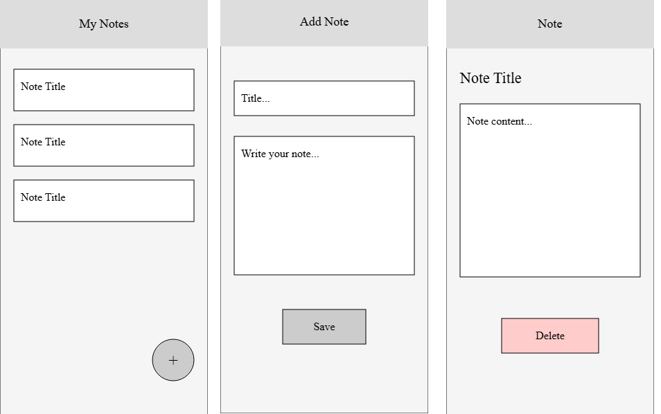

## Objectives
- React Native Screens Navigation System
- Global State Management
## React Native Navigation
So far, in our workshops, the apps we’ve built had **only one screen**. Everything the text, buttons, images, and lists was displayed on a single page

But in real-world mobile apps, users expect to navigate between multiple screens. For example:
- A **Home screen** showing a welcome message or dashboard
- A **Profile screen** showing user information
- A **Settings screen** to adjust app preferences

This is where navigation comes in. React Native handles navigation using libraries like React Navigation, which allows us to move between screens, pass data, and maintain the app’s state across different pages.
### The React Navigation Library
React Navigation is a popular React Native library that helps developers create multi-screen mobile applications with ease. It provides an intuitive way to handle navigation and screen transitions in our app, allowing for a seamless user experience across different screens. React Navigation supports both stack-based navigation and tab-based navigation, among other patterns.
To install React Navigation in your project, follow these steps:

1. **Install the core library**:
```shell
npm install @react-navigation/native
```
2. Install required dependencies:
```shell
npm install react-native-screens react-native-safe-area-context
```
### Stack Navigation
Stack Navigation is one of the most common navigation patterns in mobile apps. It works like a stack of screens: when we navigate to a new screen, it is pushed on top of the stack, and when we go back, the screen is popped off the stack.  
This behavior is similar to how many mobile apps work. For example, when we open a product in a shopping app, the product details screen appears on top of the home screen. Pressing the back button returns we to the previous screen.  
#### Working Principle of Stack Navigation 
- The first screen is placed at the bottom of the stack.
- When navigating to another screen, it is pushed onto the stack.
- When going back, the current screen is removed (popped) from the stack.
- The user always sees the top screen in the stack.
#### Using Stack Navigator
To use Stack Navigation in a React Native project, we need to install the Native Stack Navigator package:
```
npm install @react-navigation/native-stack
```
Let’s build a **simple app** that allows users to navigate between two screens: **Home** and **Details**.

We start by **cleaning the `App.tsx` file** and then importing the components we need. First, we import `Button`, `Text`, and `View` from **React Native** to build our UI.

After that, to use **Stack Navigation**, we need to import `NavigationContainer` from `@react-navigation/native` and `createNativeStackNavigator` from `@react-navigation/native-stack`.
```tsx
import { View, Text, Button } from 'react-native';  
import { NavigationContainer } from '@react-navigation/native';  
import { createNativeStackNavigator } from '@react-navigation/native-stack';  
```
The `createNativeStackNavigator` function is used to **create a stack navigator**. It returns an object that allows us to define our navigation structure using `Stack.Navigator` and `Stack.Screen`. This navigator manages a **stack of screens**, where each new screen is placed on top of the previous one. Lets create the `Stack` navigator
```ts
const Stack = createNativeStackNavigator();  
```
After that  we create two components: HomeScreen and DetailsScreen. The Home screen contains a button that allows the user to navigate to the Details screen using the `navigation.navigate()` method.
```ts
function HomeScreen({ navigation }) {  
  return (  
    <View>  
      <Text>Home Screen</Text>  
      <Button  
        title="Go to Details"  
        onPress={() => navigation.navigate('Details')}  
      />  
    </View>  
  );  
}  
  
function DetailsScreen() {  
  return (  
    <View>  
      <Text>Details Screen</Text>  
    </View>  
  );  
} 
```
First, we use `NavigationContainer`. to manages the navigation state of the app and handles linking between screens. It should wrap the entire navigation system.   
Inside `NavigationContainer`, we add `Stack.Navigator`. This component defines a stack navigation system, which means the screens will be organized in a stack where new screens are placed on top of the previous ones.   
Within `Stack.Navigator`, we define the screens of our app using `Stack.Screen`. Each `Stack.Screen` represents one screen in the navigation stack and requires two main properties:
- `name`: the name used to identify the screen in navigation.
- `component`: the React component that will be rendered when that screen is active.

When the app starts, the first screen defined inside `Stack.Navigator` becomes the initial screen, so the `HomeScreen` will appear first. From there, we can navigate to the `Details` screen using `navigation.navigate("Details")`.
```tsx
export default function App() {  
  return (  
    <NavigationContainer>  
      <Stack.Navigator>  
        <Stack.Screen name="Home" component={HomeScreen} />  
        <Stack.Screen name="Details" component={DetailsScreen} />  
      </Stack.Navigator>  
    </NavigationContainer>  
  );  
}
```
### Tab Navigation
Tab Navigation is another common navigation pattern used in mobile apps. Instead of stacking screens on top of each other, it allows users to switch between different sections of the app using tabs. These tabs are usually displayed at the bottom of the screen, and each tab represents a separate screen or feature of the application.   
Many popular apps use tab navigation. For example, a social media app may have tabs such as Home, Search, Notifications, and Profile, allowing users to quickly switch between them.
#### Working Principle of Tab Navigation
- Tabs represent different main sections of the application.
- Each tab is connected to a specific screen or component.
- Pressing a tab switches directly to that screen.
- Unlike stack navigation, switching tabs does not push screens onto a stack, it simply changes the active screen.
#### Using Tab Navigator
To use Tab Navigation, we need to install the **Bottom Tab Navigator** package:
```shell
npm install @react-navigation/bottom-tabs
```
In this example, we will build a simple app with two tabs: **Home** and **Profile**. 
First, we import `createBottomTabNavigator` from `@react-navigation/bottom-tabs`.
```tsx
import { createBottomTabNavigator } from '@react-navigation/bottom-tabs';
```
The `createBottomTabNavigator` function is used to create a tab navigator. It returns an object that allows us to define tabs using `Tab.Navigator` and `Tab.Screen`.   
Let’s create the `Tab` navigator:
```tsx
const Tab = createBottomTabNavigator();
```
Next, we create two simple components that will represent the screens for our tabs.
```tsx
function HomeScreen() {  
	return (  
		<View style={{ flex: 1, justifyContent: 'center', alignItems: 'center' }}> 
			<Text style={{ fontSize: 22, fontWeight: 'bold' }}>Home Screen</Text>  
		</View>  
);  
}  
  
function ProfileScreen() {  
	return (  
		<View style={{ flex: 1, justifyContent: 'center', alignItems: 'center' }}> 
			<Text style={{ fontSize: 22, fontWeight: 'bold' }}>Profile Screen</Text>  
		</View>  
);  
}
```
Inside the `App` component, we define our tab navigation using `Tab.Navigator` and add the screens using `Tab.Screen`.  
Each `Tab.Screen` represents a **tab in the bottom navigation bar** and requires the same properties we used before: `name` and `component`.
```tsx
export default function App() {  
  return (  
    <NavigationContainer>  
       <Tab.Navigator
        screenOptions={{
          tabBarStyle: { height: 60, paddingBottom: 5 },
          tabBarActiveTintColor: '#007AFF',
          tabBarInactiveTintColor: 'gray',
          tabBarLabelStyle: { fontSize: 14, fontWeight: '600' },
        }}
      >  
        <Tab.Screen name="Home" component={HomeScreen} />  
        <Tab.Screen name="Profile" component={ProfileScreen} />  
      </Tab.Navigator>  
    </NavigationContainer>  
  );  
}
```
We can customize the tab bar and add icons by using the `options` prop in `Tab.Screen`. One of the options we can use is `tabBarIcon`.   
The `tabBarIcon` option allows us to define an icon for each tab. It takes a callback function that returns the component we want to display as the icon.    
This callback function receives an object that contains some useful parameters such as:
- `size`: the size that the icon should use.
- `color`: the color of the icon depending on whether the tab is active or inactive.
- `focused`: a boolean value that indicates if the tab is currently active.

Inside this function, we return the component that represents the icon. This can be an icon from a library such as Ionicons, or even a local image.
```tsx
	<Tab.Screen
		name="Home"
	    component={HomeScreen}
	    options={{
	      tabBarIcon: ({ size }) => (
	        <Image
	        source={require('./assets/home.png')}
	        style={{ width: size, height: size }}
            />
	      )
	    }}
	  />

	<Tab.Screen
		name="Profile" component={ProfileScreen}
	    options={{
		  tabBarIcon: ({ size }) => (
		    <Image
		    source={require('./assets/profile.png')}
		    style={{ width: size, height: size }}
			/>
		  )
		}}
	/>
```
### Drawer Navigation
Drawer Navigation is another common navigation pattern used in mobile apps. Instead of displaying a permanent bar on the screen, it provides a hidden panel that slides in from the edge of the screen. This menu can usually be revealed by swiping or by tapping a menu icon (often a "hamburger" icon) in the header.   
Many popular apps use drawer navigation. For example, an email app or a cloud storage app may use a drawer to display different folders, labels, and account settings, allowing users to access a large number of options without cluttering the main screen interface.
#### Working Principle of Drawer Navigation
- The drawer acts as a hidden menu containing links to various sections of the application.
- Each item in the drawer is connected to a specific screen or component.
- Pressing an item from the drawer switches directly to that screen and automatically closes the drawer panel.
- Unlike stack navigation, selecting an item typically does not push new screens onto a stack; it simply changes the active view.
#### Using Drawer Navigator
To use Drawer Navigation, we need to install the Drawer Navigator package:
```shell
npm install @react-navigation/drawer
```
The navigator depends on `react-native-gesture-handler`for gestures and `react-native-reanimated`for animationsso we install those packages
```shell
npm install react-native-gesture-handler react-native-reanimated react-native-worklets 
```
After that we add the worklets plugin to `babel.config.js`
```tsx
module.exports = {
  presets: ['module:@react-native/babel-preset'],
      plugins: [
      'react-native-worklets/plugin', // we add this
    ],
};
```
Let's build simple app with two drawer items: Home and Settings.  First, we import `createDrawerNavigator` from `@react-navigation/drawer`.
```tsx
import { createDrawerNavigator } from '@react-navigation/drawer';
```
The `createDrawerNavigator` function is used to create a drawer navigator. It returns an object that allows us to define screens using `Drawer.Navigator` and `Drawer.Screen`.    
Let’s create the `Drawer` navigator:
```tsx
const Drawer = createDrawerNavigator();
```
Next, we create two simple components that will represent the screens for our drawer.
```tsx
function HomeScreen() {  
	return (  
		<View style={{ flex: 1, justifyContent: 'center', alignItems: 'center' }}> 
			<Text style={{ fontSize: 22, fontWeight: 'bold' }}>Home Screen</Text>  
		</View>  
    );  
}  
  
function SettingsScreen() {  
	return (  
		<View style={{ flex: 1, justifyContent: 'center', alignItems: 'center' }}> 
			<Text style={{ fontSize: 22, fontWeight: 'bold' }}>Settings Screen</Text>  
		</View>  
    );  
}
```
Inside the `App` component, we define our drawer navigation using `Drawer.Navigator` and add the screens using `Drawer.Screen`.

Each `Drawer.Screen` represents an item in the sliding drawer menu and requires the same properties we used before: `name` and `component`.
```tsx
export default function App() {  
  return (  
    <NavigationContainer>  
       <Drawer.Navigator
        screenOptions={{
          drawerActiveTintColor: '#007AFF',
          drawerInactiveTintColor: 'gray',
          drawerLabelStyle: { fontSize: 14, fontWeight: '600' },
          drawerStyle: { width: 250 },
        }}
      >  
        <Drawer.Screen name="Home" component={HomeScreen} />  
        <Drawer.Screen name="Settings" component={SettingsScreen} />  
      </Drawer.Navigator>  
    </NavigationContainer>  
  );  
}
```
We can customize the drawer items and add icons by using the `options` prop in `Drawer.Screen`. One of the options we can use is `drawerIcon`.

The `drawerIcon` option allows us to define an icon for each item in the drawer. It takes a callback function that returns the component we want to display as the icon.
This callback function receives an object that contains some useful parameters such as:
- `size`: the size that the icon should use.
- `color`: the color of the icon depending on whether the drawer item is active or inactive.
- `focused`: a boolean value that indicates if the drawer item is currently active.

Inside this function, we return the component that represents the icon. This can be an icon from a library such as Ionicons, or even a local image.
```tsx
	<Drawer.Screen
		name="Home"
	    component={HomeScreen}
	    options={{
	      drawerIcon: ({ size }) => (
	        <Image
	        source={require('./assets/home.png')}
	        style={{ width: size, height: size }}
            />
	      )
	    }}
	  />
	<Drawer.Screen
		name="Settings" component={SettingsScreen}
	    options={{
		  drawerIcon: ({ size }) => (
		    <Image
		    source={require('./assets/settings.png')}
		    style={{ width: size, height: size }}
			/>
		  )
		}}
	/>
```
## Global State Management in React Native
Screens are great for building powerful apps, but they introduce a challenge. Each screen is a component with its own state. This works well for simple apps, but when screens need to communicate with each other and exchange data, things can quickly become complicated. 
### Passing State Between Screens
One possible solution is to pass the state as parameters when navigating between screens. React Navigation allows us to send data from one screen to another using the `navigate` function.
```tsx
navigation.navigate("Profile", { username: "John" });
```
In the target screen, we can read the parameter using `route.params`.
```tsx
function ProfileScreen({ route }) {  
  const { username } = route.params;  
  
  return (  
    <View>  
      <Text>{username}</Text>  
    </View>  
  );  
}
```
This method works for simple cases. However, when the application grows and many screens need the same data, constantly passing parameters between screens becomes difficult to manage. This problem is commonly called prop drilling, where data must be passed through many components even if they do not use it.    
To solve this problem, modern React applications use Global State Management.
### Global State Management
To solve the mess of prop drilling, we use Global State Management. Instead of passing data down like a relay race, we store our data in a "Central Store." Any component, no matter how deep it is in the app, can plug into this store to read or update data.   
There are three main ways we handle this in React Native:
### The Context API 
The Context API is a built-in feature of React that allows us to share data across our entire component tree easily. It is excellent for managing relatively simple global state, such as the user's current theme (light/dark mode), preferred language, or basic authentication status.

To use Context, we first create it using `createContext`:
```tsx
import { createContext, useState, useContext } from 'react';

// Create the Context
const CartContext = createContext();
```
Next, we create a Provider component. This component acts as the wrapper for our app and holds the actual state data.
```tsx
export function CartProvider({ children }) {
  const [cartCount, setCartCount] = useState(0);

  return (
    <CartContext.Provider value={{ cartCount, setCartCount }}>
      {children}
    </CartContext.Provider>
  );
}
```
We must then wrap our navigation system or main app component inside this provider so the state is accessible everywhere:
```tsx
export default function App() {  
  return (  
    <CartProvider>  
      <NavigationContainer>  
         {/* Stack or Tab Navigators go here */}
      </NavigationContainer>  
    </CartProvider>  
  );  
}
```
Finally, any screen can access or update this data instantly using the `useContext` hook:
```tsx
function HomeScreen() {
  const { cartCount, setCartCount } = useContext(CartContext);

  return (
    <View style={{ flex: 1, justifyContent: 'center', alignItems: 'center' }}>
      <Text style={{ fontSize: 22 }}>Items in Cart: {cartCount}</Text>
      <Button title="Add Item" onPress={() => setCartCount(cartCount + 1)} />
    </View>
  );
}
```
#### Example
Let’s build a small app to demonstrate how this works.   First, we create a `context` folder where we will store our Context logic. Inside this folder, we create our cart context.    
**`context/ThemeContext.tsx`**
```tsx
import React, { createContext, useState } from "react";

export const ThemeContext = createContext(null);

export function ThemeProvider({ children }) {
  const [theme, setTheme] = useState("light");
  function toggleTheme() {
    setTheme((prev) => (prev === "light" ? "dark" : "light"));
  }

  return (
    <ThemeContext.Provider
      value={{
        theme,
        toggleTheme,
      }}
    >
      {children}
    </ThemeContext.Provider>
  );
}
```
Next, we create a **`screens` folder** where we will declare our screens.  
For this example, we will need **three screens**, so we create three files as follows:
```
screens/  
├── HomeScreen.tsx  
├── ProfileScreen.tsx  
└── SettingsScreen.tsx
```
`screens/HomeScreen.tsx`
```tsx
import React, { useContext } from "react";  
import { View, Text, Button } from "react-native";  
import { ThemeContext } from "../context/ThemeContext";  

export default function HomeScreen({ navigation }) {  
  const { theme } = useContext(ThemeContext);  
  const backgroundColor = theme === "light" ? "#fff" : "#222";  
  const textColor = theme === "light" ? "#000" : "#fff";  
  return (  
    <View  
      style={{  
        flex: 1,  
        backgroundColor,  
        justifyContent: "center",  
        alignItems: "center",  
      }}  
    >  
      <Text style={{ fontSize: 24, color: textColor }}>  
        Home Screen  
      </Text>  
      <Text style={{ marginTop: 10, color: textColor }}>  
        Current Theme: {theme}  
      </Text>  
      <View style={{ display:"flex", flexDirection: "row", gap:10,marginTop: 20 }}>
      <Button  
        title="Go to Profile"  
        onPress={() => navigation.navigate("Profile")}  
      />  
      <Button  
        title="Go to Settings"  
        onPress={() => navigation.navigate("Settings")}  
      />
      </View>
    </View>  
  );  
}
```
**``screens/ProfileScreen.tsx``**
```tsx
import React, { useContext } from "react";  
import { View, Text, Button } from "react-native";  
import { ThemeContext } from "../context/ThemeContext";  
export default function ProfileScreen({ navigation }) {  
  const { theme } = useContext(ThemeContext);  
  const backgroundColor = theme === "light" ? "#fff" : "#222";  
  const textColor = theme === "light" ? "#000" : "#fff";  
  return (  
    <View  
      style={{  
        flex: 1,  
        backgroundColor,  
        justifyContent: "center",  
        alignItems: "center",  
      }}  
    >  
      <Text style={{ fontSize: 24, color: textColor }}>  
        Profile Screen  
      </Text>  
      <Text style={{ marginTop: 10, color: textColor }}>  
        Theme: {theme}  
      </Text>
      <View style={{ display:"flex", flexDirection: "row", gap:10,marginTop: 20 }}>
        <Button  
        title="Go to Home"  
        onPress={() => navigation.navigate("Home")}  
      />  
      <Button  
        title="Go to Settings"  
        onPress={() => navigation.navigate("Settings")}  
      />  
      </View>
    </View>  
  );  
}
```
**``screens/SettingsScreen.tsx``**
```tsx
import React, { useContext } from "react";  
import { View, Text, Button, ViewBase } from "react-native";  
import { ThemeContext } from "../context/ThemeContext";  

export default function SettingsScreen({ navigation }) {  
  const { theme, toggleTheme } = useContext(ThemeContext);  
  const backgroundColor = theme === "light" ? "#fff" : "#222";  
  const textColor = theme === "light" ? "#000" : "#fff";  
  return (  
    <View  
      style={{  
        flex: 1,  
        backgroundColor,  
        justifyContent: "center",  
        alignItems: "center",  
      }}  
    >  
      <Text style={{ fontSize: 24, color: textColor }}>  
        Settings Screen  
      </Text>  
      <Text style={{ marginTop: 10, color: textColor }}>  
        Current Theme: {theme}  
      </Text>  
      <View style={{ marginTop: 20 }}>
      <Button  
        title="Toggle Theme"  
        onPress={toggleTheme}  
      />  
      </View>
      <View style={{ display:"flex", flexDirection: "row", gap:10,marginTop: 20 }}>
      <Button  
              title="Go to Home"  
              onPress={() => navigation.navigate("Home")}  
            />  
            <Button  
                    title="Go to Profile"  
                    onPress={() => navigation.navigate("Profile")}  
                  />  
                  </View>
    </View>  
  );  
}
```
In our screens we import the and use `ThemeContext` which allow us to read and change the them.

Finally,  in **`App.tsx`**, we import the `ThemeProvider` and wrap the `NavigationContainer` inside it so all our screen will have access to the them context
```tsx 
import React from "react";  
import { NavigationContainer } from "@react-navigation/native";  
import { createNativeStackNavigator } from "@react-navigation/native-stack";  
  
import { ThemeProvider } from "./context/ThemeContext";  
  
import HomeScreen from "./screens/HomeScreen";  
import ProfileScreen from "./screens/ProfileScreen";  
import SettingsScreen from "./screens/SettingsScreen";  
  
const Stack = createNativeStackNavigator();  
  
export default function App() {  
  return (  
    <ThemeProvider>  
      <NavigationContainer>  
        <Stack.Navigator>  
          <Stack.Screen name="Home" component={HomeScreen} />  
          <Stack.Screen name="Profile" component={ProfileScreen} />  
          <Stack.Screen name="Settings" component={SettingsScreen} />  
        </Stack.Navigator>  
      </NavigationContainer>  
    </ThemeProvider>  
  );  
}
```
### Redux
While the Context API is great, it can cause performance issues in large applications because every time the context value changes, every component consuming that context will re-render. For complex, large-scale applications, developers rely on external libraries like Redux (specifically modern Redux Toolkit).

Redux enforces a strict, predictable pattern for managing state:
1. **Store:** The single source of truth that holds all the global state.
2. **Actions:** Events that describe something happening in the app (e.g., "ADD_ITEM").
3. **Reducers:** Functions that take the current state and the action, and return a new, updated state.

To work with redux we first need to install it 
```shell
npm install @reduxjs/toolkit react-redux
```
With Redux Toolkit, we create a "slice" of state, which combines actions and reducers into one simple file:
```tsx
import { createSlice } from '@reduxjs/toolkit';

const cartSlice = createSlice({
  name: 'cart',
  initialState: {
    cartCount: 0,
  },
  reducers: {
    incrementCart: (state) => {
      state.cartCount += 1;
    },
  },
});

export const { incrementCart } = cartSlice.actions;
export default cartSlice.reducer;
```
Next, we configure the "Store." This central store combines all of our different slices into one global state object.
```tsx
import { configureStore } from '@reduxjs/toolkit';
import cartReducer from './cartSlice';

export const store = configureStore({
  reducer: {
    cart: cartReducer,
  },
});
```
We must then wrap our navigation system or main app component inside a `Provider` and pass the store to it, so the state is accessible everywhere:
```tsx
import { Provider } from 'react-redux';
import { store } from './store';

export default function App() {  
  return (  
    <Provider store={store}>  
      <NavigationContainer>  
         {/* Stack or Tab Navigators go here */}
      </NavigationContainer>  
    </Provider>  
  );  
}
```
Finally, any screen can access the data using the `useSelector` hook, and update it instantly using the `useDispatch` hook:
```tsx
import { useSelector, useDispatch } from 'react-redux';
import { incrementCart } from './cartSlice';

function HomeScreen() {
  const cartCount = useSelector((state) => state.cart.cartCount);
  const dispatch = useDispatch();

  return (
    <View style={{ flex: 1, justifyContent: 'center', alignItems: 'center' }}>
      <Text style={{ fontSize: 22 }}>Items in Cart: {cartCount}</Text>
      <Button title="Add Item" onPress={() => dispatch(incrementCart())} />
    </View>
  );
}
```

#### Example
Let’s build a small app to demonstrate how this works. First, we create a `store` folder where we will store our Redux logic. Inside this folder, we create our counter slice and configure the store.
**`store/counterSlice.ts`**
```tsx
import { createSlice } from "@reduxjs/toolkit";

export const counterSlice = createSlice({
  name: "counter",
  initialState: {
    value: 0,
  },
  reducers: {
    increment: (state) => {
      state.value += 1;
    },
    decrement: (state) => {
      state.value -= 1;
    },
    incrementByTen: (state) => {
      state.value += 10;
    },
  },
});

export const { increment, decrement, incrementByTen } = counterSlice.actions;
export default counterSlice.reducer;
```
**`store/store.ts`**
```tsx
import { configureStore } from "@reduxjs/toolkit";
import counterReducer from "./counterSlice";

export const store = configureStore({
  reducer: {
    counter: counterReducer,
  },
});
```

Next, we create a **`screens` folder** where we will declare our screens. For this example, we will need **three screens**, so we create three files as follows:

```
screens/  
├── HomeScreen.tsx  
├── FastIncrementScreen.tsx  
└── AdjustScreen.tsx
```

**`screens/HomeScreen.tsx`**
```tsx
import React from "react";  
import { View, Text, Button } from "react-native";  
import { useSelector, useDispatch } from "react-redux";  
import { increment } from "../store/counterSlice";

export default function HomeScreen({ navigation }) {  
  const count = useSelector((state) => state.counter.value);  
  const dispatch = useDispatch();

  return (  
    <View style={{ flex: 1, justifyContent: "center", alignItems: "center" }}>  
      <Text style={{ fontSize: 24 }}>Home: Increment by 1</Text>  
      <Text style={{ fontSize: 40, marginVertical: 20 }}>{count}</Text>  
      <View style={{marginBottom: 20}}>
      <Button title="Add 1" onPress={() => dispatch(increment())} />
      </View>
      <View style={{ flexDirection: 'column', gap: 20}}>
      <Button  
        title="Go to Fast Increment"  
        onPress={() => navigation.navigate("Fast")}  
      />  
      <Button  
        title="Go to Adjust Screen"  
        onPress={() => navigation.navigate("Adjust")}  
      />  
      </View>
    </View>  
  );  
}
```

**`screens/FastIncrementScreen.tsx`**
```tsx
import React from "react";  
import { View, Text, Button } from "react-native";  
import { useSelector, useDispatch } from "react-redux";  
import { incrementByTen } from "../store/counterSlice";

export default function FastIncrementScreen({ navigation }) {  
  const count = useSelector((state) => state.counter.value);  
  const dispatch = useDispatch();

  return (  
    <View style={{ flex: 1, justifyContent: "center", alignItems: "center", backgroundColor: '#f9f9f9' }}>  
      <Text style={{ fontSize: 24 }}>Fast: Increment by 10</Text>  
      <Text style={{ fontSize: 40, marginVertical: 20 }}>{count}</Text>  
      <View style={{marginBottom: 20}}>
        <Button title="Add 10" color="green" onPress={() => dispatch(incrementByTen())} />  
      </View>
      <View style={{ flexDirection: 'column', gap: 20 }}>
        <Button
          title="Go to Home"
          onPress={() => navigation.navigate("Home")}  
        />  
        <Button  
          title="Go to Adjust Screen"  
          onPress={() => navigation.navigate("Adjust")}  
        />  
      </View>
    </View>  
  );  
}
```

**`screens/AdjustScreen.tsx`**
```tsx
import React from "react";  
import { View, Text, Button } from "react-native";  
import { useSelector, useDispatch } from "react-redux";  
import { increment, decrement } from "../store/counterSlice";  

export default function AdjustScreen({navigation}) {  
  const count = useSelector((state) => state.counter.value);  
  const dispatch = useDispatch();  
  return (  
    <View style={{ flex: 1, justifyContent: "center", alignItems: "center" }}>  
      <Text style={{ fontSize: 24 }}>Adjust: +/- 1</Text>  
      <Text style={{ fontSize: 40, marginVertical: 20 }}>{count}</Text>  
      <View style={{ flexDirection: 'row', gap: 20 , marginBottom:20}}>
        <Button title="Decrease" color="red" onPress={() => dispatch(decrement())} />  
        <Button title="Increase" color="blue" onPress={() => dispatch(increment())} />  
      </View>
      <View style={{ flexDirection: 'column', gap: 20}}>
        <Button
          title="Go to Home"
          onPress={() => navigation.navigate("Home")}  
          />  
        <Button  
          title="Go to Fast Increment"  
          onPress={() => navigation.navigate("Fast")}  
          />    
        </View>
    </View>  
  );  
}
```
In our screens, we import and use **`useSelector`** to read the counter state, and **`useDispatch`** to trigger the specific actions (`increment`, `decrement`, or `incrementByTen`) when we want to change it.

Finally, in **`App.tsx`**, we import the **`Provider`** from `react-redux` alongside our **`store`**, and wrap the `NavigationContainer` inside it so all our screens will have access to the Redux store.
```tsx
import React from "react";  
import { NavigationContainer } from "@react-navigation/native";  
import { createNativeStackNavigator } from "@react-navigation/native-stack";  
import { Provider } from "react-redux";  
import { store } from "./store/store";  
  
import HomeScreen from "./screens/HomeScreen";  
import FastIncrementScreen from "./screens/FastIncrementScreen";  
import AdjustScreen from "./screens/AdjustScreen";  
  
const Stack = createNativeStackNavigator();  
  
export default function App() {  
  return (  
    <Provider store={store}>  
      <NavigationContainer>  
        <Stack.Navigator>  
          <Stack.Screen name="Home" component={HomeScreen} />  
          <Stack.Screen name="Fast" component={FastIncrementScreen} />  
          <Stack.Screen name="Adjust" component={AdjustScreen} />  
        </Stack.Navigator>  
      </NavigationContainer>  
    </Provider>  
  );  
}
```
### Zustand
While Redux is very powerful, it can sometimes feel verbose and complex for small or medium applications. Developers must define actions, reducers, slices, and wrap the application in a provider.  To simplify global state management, many developers use Zustand.
Zustand is a small, fast, and scalable state management library for React. It removes much of the boilerplate found in Redux while still providing a global store that any component can access.

Zustand relies on a very simple and intuitive pattern:
- **Store:** A custom hook that holds both your global state variables and the actions (functions) to update them.
- **No Providers:** Unlike Redux or Context, you don't need to wrap your app in a Provider component. Your component tree stays clean.

To work with Zustand, we first need to install it:
```shell
npm install zustand
```
Next, we create a store using the `create` function, which combines our initial state and our update functions into one simple file:
```tsx
import { create } from "zustand";  
  
export const useCartStore = create((set) => ({  
  cartCount: 0,  
  
  incrementCart: () =>  
    set((state) => ({  
      cartCount: state.cartCount + 1,  
    })),  
}));
```
Here we defined:
- **cartCount** the global state
- **incrementCart** a function that updates the state

The `set` function updates the state, similar to `setState` in React.   
Finally, any screen can access the data and update it instantly by calling the hook `useCartStore` . We can select specific pieces of state so that our component only re-renders when that exact piece of state changes:
```tsx
import { View, Text, Button } from 'react-native';
import { useCartStore } from './useCartStore';

function HomeScreen() {
  const cartCount = useCartStore((state) => state.cartCount);
  const incrementCart = useCartStore((state) => state.incrementCart);

  return (
    <View style={{ flex: 1, justifyContent: 'center', alignItems: 'center' }}>
      <Text style={{ fontSize: 22 }}>Items in Cart: {cartCount}</Text>
      <Button title="Add Item" onPress={incrementCart} />
    </View>
  );
}
```

## Building Note App
Let’s build note managing app to exercice what we lernt in this lecture. The App will have three screen, one for adding note one for viewing the note list and one to display note details, Here the wireframe.



### Creating Global State
We will use **Zustand** to manage the global state of our notes. First, we create a `store` folder where we place all our state management logic. Inside it, we define a store that holds the list of notes and the functions used to modify them.

**``store/useNotesStore.ts``**
```ts
import { create } from "zustand";

export const useNotesStore = create((set) => ({
  notes: [],
  addNote: (title, body) =>set((state) => ({
    notes: [
        ...state.notes,
        {
          id: Date.now().toString(),
          title: title,
          body: body,
        },
      ],
    })),
  
  deleteNote: (id) =>
    set((state) => ({
      notes: state.notes.filter((note) => note.id !== id),
    })),
}));
```
In this store, we define a `notes` array that will contain all notes created by the user. We also define two actions: `addNote` and `deleteNote`.  
`addNote` creates a new note object and adds it to the existing notes array using the spread operator. Each note also receives a unique `id`.  
`deleteNote` removes a note by filtering the array and keeping only the notes whose `id` does not match the one provided.
### Creating Screens
Next, we create a `screens` folder where we will declare our screens. We will need three screens, so we create three files as follows:
```
screens/  
├── NotesListScreen.tsx  
├── AddNoteScreen.tsx  
└── NoteDetailScreen.tsx
```
### Add Note Screen
This screen allows the user to create a new note. We use React’s `useState` to temporarily store the title and body entered in the input fields.
```tsx
import { useState } from "react";
import { View, Text,TextInput,TouchableOpacity} from "react-native";
import { useNotesStore } from "../store/useNotesStore";

import {styles} from "../styles/style";

export default function AddNoteScreen({ navigation }) {
  const [title, setTitle] = useState("");
  const [body, setBody] = useState("");
  const addNote = useNotesStore((state) => state.addNote);
  const handleAdd = () => {
    addNote(title, body);
    navigation.goBack();
  };
  return (
    <View style={styles.container}>
      <Text style={styles.label}>Title</Text>
      <TextInput
        placeholder="Enter note title..."
        value={title}
        onChangeText={setTitle}
        style={styles.titleInput}
      />
      <Text style={styles.label}>Body</Text>
      <TextInput
        placeholder="Write your note here..."
        value={body}
        onChangeText={setBody}
        multiline
        textAlignVertical="top"
        style={styles.bodyInput}
      />
      <TouchableOpacity style={styles.saveButton} onPress={handleAdd}>
        <Text style={styles.saveText}>Save Note</Text>
      </TouchableOpacity>
    </View>
  );
}
```
When the Save Note button is pressed, the `handleAdd` function calls the `addNote` action from the store. This updates the global state with the new note. After saving, we navigate back to the previous screen so the user can see the updated notes list.
#### Notes List Screen
This screen displays all notes stored in the global state.
```tsx
import { View, Text,FlatList, TouchableOpacity } from "react-native";
import { useNotesStore } from "../store/useNotesStore";
import { styles } from "../styles/style";
import { useNavigation } from '@react-navigation/native';

export default function NotesListScreen({ navigation }) {
  const notes = useNotesStore((state) => state.notes);
  
  return (
    <View style={{ flex: 1, padding: 20 }}>
    <FlatList  
        data={notes}  
        keyExtractor={(item) => item.id}  
        renderItem={({ item }) => (  
        <TouchableOpacity style={styles.noteCard} onPress={() => navigation.navigate("Detail", { note: item })} >
            <Text style={styles.title}>{item.title}</Text>
            <Text style={styles.bodyPreview} numberOfLines={2}>
                {item.body}
            </Text>
        </TouchableOpacity>
        )}  
        />
    <TouchableOpacity
        style={styles.fab}
        onPress={() => navigation.navigate("AddNote")}
        >  
        <Text style={styles.fabText}>+</Text>
    </TouchableOpacity>
    </View>
  );
}
```
We retrieve the `notes` array from the store using `useNotesStore`. The notes are rendered using `FlatList`. Each note is shown inside a card with a short preview of its content.

When the user taps a note, we navigate to the detail screen and pass the selected note as a parameter.
#### Note Detail Screen
This screen shows the full content of a selected note and provides an option to delete it.
```tsx
import React from "react";
import { View, Text, Button } from "react-native";
import { useNotesStore } from "../store/useNotesStore";
import {styles} from "../styles/style";

export default function NoteDetailScreen({ route, navigation }) {
  const { note } = route.params;
  const deleteNote = useNotesStore((state) => state.deleteNote);
  const handleDelete = () => {
    deleteNote(note.id);
    navigation.goBack();
  };

  return (
    <View style={styles.note}>
      <View style={styles.content}>
        <Text style={styles.notetitle}>{note.title}</Text>
        <Text style={styles.body}>{note.body}</Text>
      </View>
      <View style={styles.deleteContainer}>
        <Button title="Delete Note" color="#e53935" onPress={handleDelete} />
      </View>
    </View>
  );
}
```
The note object is received through the navigation route parameters. The screen also accesses the `deleteNote` function from the store. When the delete button is pressed, the note is removed from the global state and the app navigates back to the notes list.
### Navigation Setup
Finally, we configure navigation using React Navigation.
```tsx
import React from "react";
import { NavigationContainer } from "@react-navigation/native";
import { createNativeStackNavigator } from "@react-navigation/native-stack";

import NotesListScreen from "./screens/NotesListScreen";
import AddNoteScreen from "./screens/AddNoteScreen";
import NoteDetailScreen from "./screens/NoteDetailScreen";

const Stack = createNativeStackNavigator();

export default function App() {
  return (
    <NavigationContainer>
      <Stack.Navigator>
        <Stack.Screen name="Notes" component={NotesListScreen} />
        <Stack.Screen name="AddNote" component={AddNoteScreen} />
        <Stack.Screen name="Detail" component={NoteDetailScreen} />
      </Stack.Navigator>
    </NavigationContainer>
  );
}
```
We create a stack navigator that connects the three screens: the notes list, add note screen, and note detail screen. Since Zustand does not require a provider, we can use the store directly inside our components without wrapping the application.
### Adding Style
To make our app look good, we create a `styles` folder and add a `style.ts` file. Inside, we use React Native’s `StyleSheet` to define reusable style objects for all screens and components.
```ts
import { StyleSheet } from "react-native";
export const styles = StyleSheet.create({

  container: {
    flex: 1,
    padding: 20,
    backgroundColor: "#f2f4f7",
  },
  label: {
    fontSize: 16,
    marginBottom: 6,
    color: "#444",
    fontWeight: "600",
  },
  titleInput: {
    borderWidth: 1,
    borderColor: "#ddd",
    backgroundColor: "white",
    padding: 12,
    borderRadius: 10,
    fontSize: 18,
    marginBottom: 20,
  },
  bodyInput: {
    borderWidth: 1,
    borderColor: "#ddd",
    backgroundColor: "white",
    padding: 14,
    borderRadius: 12,
    fontSize: 16,
    height: 180,
    lineHeight: 22,
    shadowColor: "#000",
    shadowOpacity: 0.05,
    shadowRadius: 5,
  },
  saveButton: {
    marginTop: 30,
    backgroundColor: "#4a6cf7",
    padding: 16,
    borderRadius: 12,
    alignItems: "center",
  },
  saveText: {
    color: "white",
    fontSize: 16,
    fontWeight: "600",
  },
  noteCard:{
    backgroundColor:"white",
    padding:16,
    borderRadius:12,
    marginBottom:12,
    shadowColor:"#000",
    shadowOpacity:0.05,
    shadowRadius:6,
    elevation:2
  },
  title:{
    fontSize:18,
    fontWeight:"bold",
    marginBottom:4
  },
  bodyPreview:{
    color:"#666"
  },
  fab:{
    position:"absolute",
    right:20,
    bottom:30,
    backgroundColor:"#4a6cf7",
    width:60,
    height:60,
    borderRadius:30,
    alignItems:"center",
    justifyContent:"center",
    elevation:5
  },

  fabText:{
    color:"white",
    fontSize:30,
    fontWeight:"bold"
  },
  note: {
    flex: 1,
    padding: 20,
    backgroundColor: "#fff",
    justifyContent: "space-between",
  },
  notetitle: {
    fontSize: 28,
    fontWeight: "bold",
    color: "#222",
    marginBottom: 15,
  },
  content: {
    marginTop: 20,
  },
  body: {
    fontSize: 18,
    lineHeight: 26,
    color: "#555",
  },
  deleteContainer: {
    marginBottom: 20,
  },
});
```