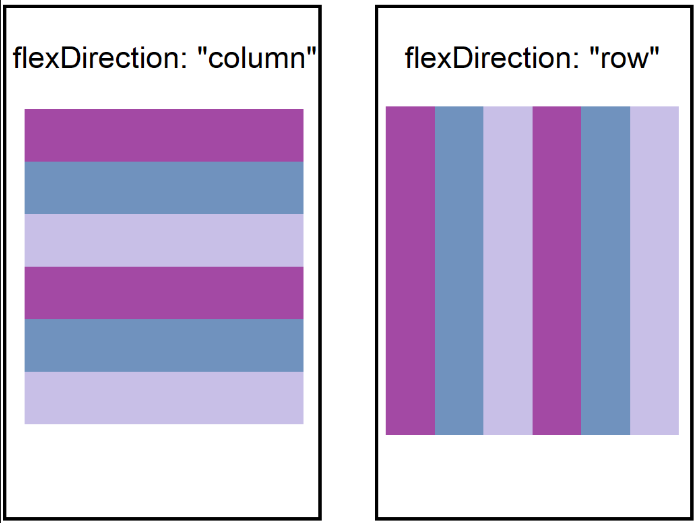
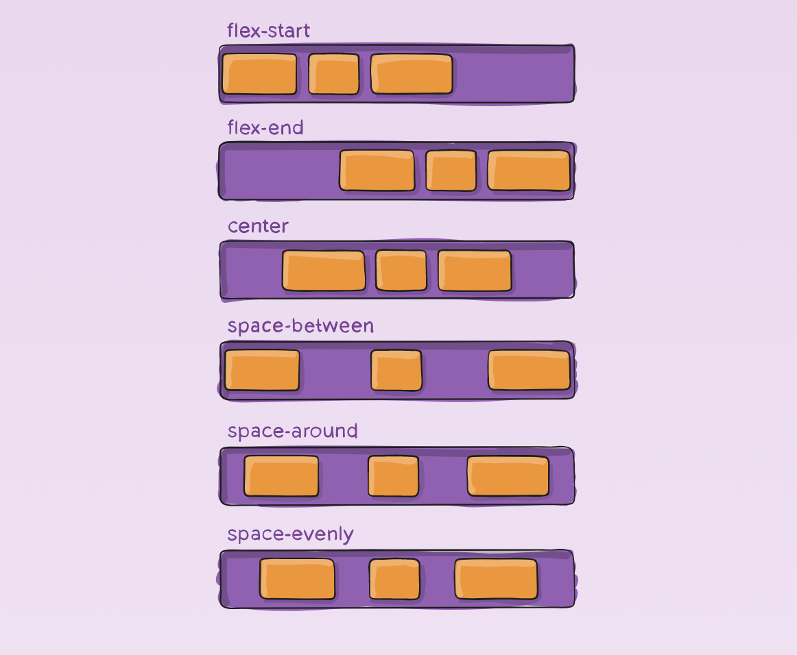
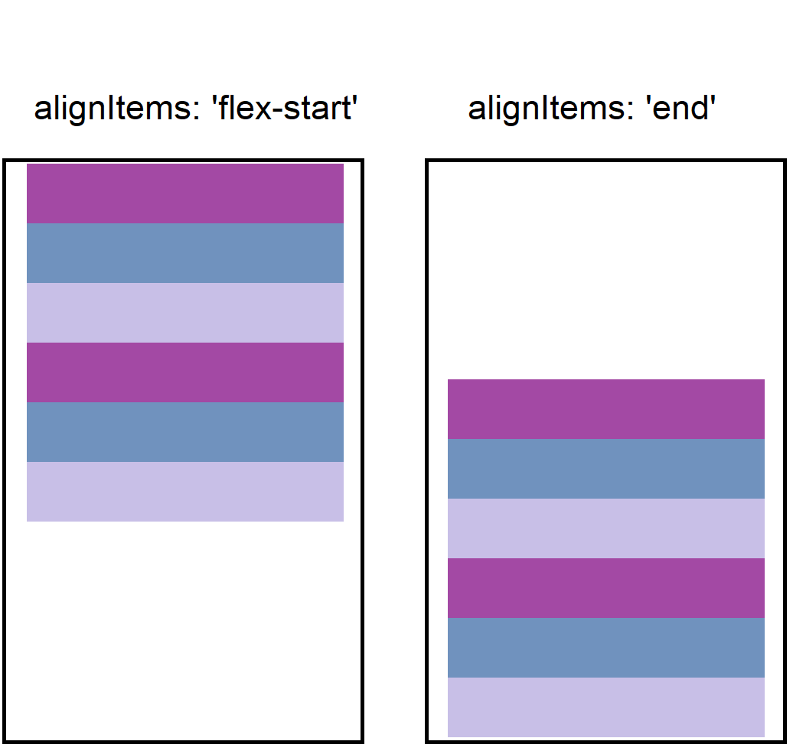
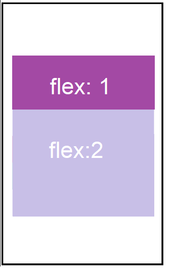

## Objectives
- Persistent Storage in React Native
- Responsive Design and Animation
## Persistent Data Storage in React Native
State management (Context API, Redux, Zustand) is excellent for managing how our app behaves while it's running. However, these solutions have a major limitation: they are stored in RAM (memory). When a user force-closes the app, restarts their phone, or the OS kills the process to save battery, all that state vanishes.  
**Persistence** solves this. It allows us to save data directly onto the device's physical storage. This ensures that when the user re-opens the app, their settings, authentication tokens, or offline cache are exactly where they left them.   
React Native itself does not include a built-in persistent storage engine out of the box. Instead, it relies on the bridge architecture (or JSI) to communicate with the native storage systems of iOS and Android. Because apps have different needs ranging from saving a simple "Dark Mode" preference to storing thousands of complex relational records offline there are various ways to achieve this.

Let's explore the most prominent tools and libraries available for persistent storage in React Native
### AsyncStorage
AsyncStorage is the most common, fundamental key-value storage system for React Native. It operates asynchronously, meaning it won't block the main thread while reading or writing data. It stores data strictly as strings, so complex data types (like objects or arrays) must be converted using `JSON.stringify()` before saving and `JSON.parse()` after reading.

It is perfect for lightweight data: user preferences, theme settings, or simple session tokens. However, it is not recommended for storing large datasets or heavy relational data due to performance constraints.

To use AsyncStorage we first install the package.
```shell
npm install @react-native-async-storage/async-storage@2
```
AsyncStorage is built around **four main methods** that let us manage data in a key-value style. 
- `setItem` Store a value under a specific key.
- `getItem` Get the value stored under a key.
- `removeItem `Remove a specific key and its value.
- `clear` Remove everything stored in AsyncStorage.

Since `AsyncStorage` is asynchronous, all its methods return promises. The best way to work with it in a React component is by handling these promises inside a `useEffect` hook.
#### Example
Let’s update our `Todo_App` from `Workshop 2` to use persistent data storage. To do this, we first need to install the `AsyncStorage` library.  
```shell
npm install @react-native-async-storage/async-storage@2
```
After installing, we modify the `App.tsx` file. We start by importing the library, 
```tsx
import AsyncStorage from "@react-native-async-storage/async-storage";
```
After that , inside the ``App`` component, we create two `useEffect` hooks:
The first `useEffect` loads the list of items when the app starts.
```tsx
useEffect(() => {
    const loadTasks = async () => {
      try {
        const storedTasks = await AsyncStorage.getItem("tasks");
        if (storedTasks) {
          setTasks(JSON.parse(storedTasks));
        }
      } catch (error) {
        console.error("Failed to load tasks:", error);
      }
    };
    loadTasks();
  }, []);
```
The second `useEffect` updates the stored data whenever any changes occur in the ``tasks`` list.
```tsx
  useEffect(() => {
    const saveTasks = async () => {
      try {
        await AsyncStorage.setItem("tasks", JSON.stringify(tasks));
      } catch (error) {
        console.error("Failed to save tasks:", error);
      }
    };
    saveTasks();
  }, [tasks]);
```
With this small update, our app becomes more persistent. Closing the app or restarting the phone will no longer clear the data.
### MMKV
While AsyncStorage is great for basic needs, it can be slow. MMKV is an exceptionally fast, highly efficient key-value storage framework originally developed by WeChat. It uses memory-mapped files under the hood, making it up to 30x faster than AsyncStorage.    
Unlike AsyncStorage, MMKV is synchronous. We don't need to use `async/await` to read or write data, which makes our code cleaner and our app's performance significantly smoother.   
Another advantage of MMKV is that it supports **multiple data types directly** (strings, numbers, booleans, and objects), removing the need for manual serialization in many cases.

To use MMKV in a React Native project we install the package:
```shell
npm install react-native-mmkv react-native-nitro-modules
```
MMKV offer more methods to work with data:
- `set(key, value)`  Store a value.
- `getString(key)`  Retrieve a string.
- `getNumber(key)` Retrieve a number.
- `getBoolean(key)` Retrieve a boolean.
- `delete(key)` Remove a specific key.
- `clearAll()` Remove all stored data.
#### Example
Let’s make `Todo_App`  `MMKV` instead of  `AsyncStorage`, first  in top of our file we import `createMMKV` and create an instance of the storage object.
```tsx
import  { createMMKV } from "react-native-mmkv";

const storage = createMMKV();
```
Next, we edit the **first `useEffect`**. We retrieve the stored value using `getString`. If nothing is stored yet, we return an empty array (`'[]'`) as a default value. Then we parse the string and update the `tasks` state.
```tsx
  useEffect(() => {
    const storedTasks = storage.getString("tasks") || '[]';
    setTasks(JSON.parse(storedTasks));
  },[]);
```
the second `useEffect`, we save the tasks every time the `tasks` state changes.  
Using `storage.set`, we store the updated list by converting it into a string with `JSON.stringify`.
```tsx
useEffect(() => {
    storage.set("tasks", JSON.stringify(tasks));
  }, [tasks]);
```
We can see how MMKV is easier to work with than AsyncStorage. Since its API is synchronous, we no longer need `async` functions, `await`, or additional error-handling blocks just to read or write data.
### Realm
While simple key-value storage solutions like AsyncStorage or MMKV work well for lightweight data, some applications require a more powerful way to manage complex data. Realm is a mobile database designed specifically for high-performance apps. Instead of storing raw key-value pairs, Realm lets us work with structured objects, similar to working with models in a traditional database.

One of Realm’s biggest advantages is that it is object-based. We define schemas (data models), and Realm automatically handles storing and retrieving those objects. This makes it ideal for apps that manage structured data such as lists, user profiles, or relationships between objects.

Realm is also extremely fast because it stores data in a native database engine optimized for mobile devices. It supports features like live queries, meaning that when data changes, the UI can automatically update without manual state management.

To use Realm in a React Native project we install the package:
```shell
npm install realm
```
After installing the packages we need to declare our **schema**, which defines the structure of the data that will be stored in the Realm database. A schema describes what fields an object has, their data types, and any relationships with other objects.   
The schema acts like a blueprint for our data.  
It tells Realm:
- What objects exist in the database
- What properties (fields) those objects have
- The data type of each property
- Which field is the primary key
- Whether a field is optional
#### Creating Schema
Lets defines a data model (schema) for a task in Realm Database using TypeScript classes. The class describes how a Task object will be stored in the database.
```ts
import Realm from "realm";  
  
class Task extends Realm.Object<Task> {  
  _id!: Realm.BSON.ObjectId;  
  text!: string;  
  completed!: boolean;  
  
  static schema = {  
    name: "Task",  
    primaryKey: "_id",  
    properties: {  
      _id: "objectId",  
      text: "string",  
      completed: "bool",  
    },  
  };  
}  
```
First, we imported Realm from the Realm Database package so we can use its database features inside our application. After that, we create a class called **Task** that extends `Realm.Object`.
```ts
import Realm from "realm";  
  
class Task extends Realm.Object<Task> {  
}
```
Next we defined three fields: `_id` (a unique `ObjectId`), `text` (a string describing the task), and `completed` (a boolean indicating if the task is done). The `!` in TypeScript shows that Realm will initialize these fields. These type declarations help TypeScript understand the kind of data each property holds.
```ts
_id!: Realm.BSON.ObjectId;  
text!: string;  
completed!: boolean;
```
After declaring the fields, we define a **static schema** for the class. This schema tells Realm how the data should be stored in the database. The `name` property specifies the name of the collection, which is `"Task"`. The `primaryKey` is set to `_id`, meaning this field uniquely identifies each record. Finally, inside `properties`, we define the data types of each field using Realm’s type system (`objectId`, `string`, and `bool`).
```ts
 static schema = {  
    name: "Task",  
    primaryKey: "_id",  
    properties: {  
      _id: "objectId",  
      text: "string",  
      completed: "bool",  
    },  
  };
```
#### Interecting with The Database
Once the schema is defined, the next step is to **open the Realm database**. We do this by creating a new `Realm` instance and passing it a configuration object with two main properties: `schema`, which is the array of schemas to be used (in this case, the Task schema we defined earlier), and `schemaVersion`, which is a number representing the version of the schema. The `schemaVersion` is important because it allows Realm to handle **migrations** if the schema changes in the future.
```ts

import Realm from "realm";  
  
const realm = new Realm({  
  schema: [Task.schema], // Pass the Task schema  
  schemaVersion: 1,      // Version for future migrations  
});
```
Once the Realm instance is created, we can start working with data using CRUD operations: creating, reading, updating, and deleting Task objects.

- **Creating a Task** involves using a **write transaction** with `realm.create`, providing a unique `_id`, a `text` description, and a `completed` status:
```ts

realm.write(() => {  
  realm.create("Task", {  
    _id: new Realm.BSON.ObjectId(),  
    text: "Finish mobile development lecture",  
    completed: false,  
  });  
});
```
- **Reading Tasks** is done using `realm.objects("Task")`, which returns a live collection of all tasks. You can filter this collection to get specific tasks:
```ts
const allTasks = realm.objects("Task");  
const incompleteTasks = allTasks.filtered("completed == false");
```
- **Updating a Task** also requires a write transaction. You can find a task and modify its properties, and Realm will automatically persist the changes:
```ts
realm.write(() => {  
  const task = realm.objects("Task").filtered('text == "Finish mobile development lecture"')[0];  
  if (task) {  
    task.completed = true;  
  }  
});
```
- **Deleting a Task** uses a similar write block:
```ts
realm.write(() => {  
  const task = realm.objects("Task").filtered('text == "Finish mobile development lecture"')[0];  
  if (task) {  
    realm.delete(task);  
  }  
});
```
### SQLite
While object-based databases like Realm are fantastic for seamless object management, sometimes our application requires the power, structure, and flexibility of a traditional relational database. SQLite is a lightweight, embedded SQL database engine that lives directly on the mobile device. Instead of storing data as objects, SQLite stores data in tables with rows and columns, making it ideal for apps that require complex data relationships, advanced querying, or for developers who want to leverage their existing SQL knowledge.

One of SQLite’s biggest advantages is its ubiquity and reliability. It uses standard SQL syntax, meaning we can perform complex `JOIN` operations, precise filtering, and aggregations that might be more cumbersome in simple key-value stores.

To use SQLite in a React Native project, we typically install a wrapper like `react-native-sqlite-storage`:
```shell
npm install react-native-sqlite-storage
```
After installing the package, instead of declaring a class-based schema like we did in Realm, we use SQL queries to define the structure of our tables. We still need to describe what columns exist, their data types, and the primary key.

It tells SQLite:
- What tables to create
- What columns (fields) belong to those tables
- The data type of each column (e.g., `INTEGER`, `TEXT`)
- Which column is the primary key and if it auto-increments
#### Setting Up and Creating Tables
Let's define a data model for a task in SQLite. First, we need to open a connection to the database and then execute a `CREATE TABLE` query.
```ts
import SQLite from 'react-native-sqlite-storage';

// Enable promises for a cleaner, modern async/await syntax
SQLite.enablePromise(true);

const getDBConnection = async () => {
  return SQLite.openDatabase({ name: 'task-app.db', location: 'default' });
};

const createTables = async (db: SQLite.SQLiteDatabase) => {
  const query = `
    CREATE TABLE IF NOT EXISTS Task (
      id INTEGER PRIMARY KEY AUTOINCREMENT,
      text TEXT NOT NULL,
      completed INTEGER DEFAULT 0
    );
  `;
  await db.executeSql(query);
};
```
First, we imported our SQLite package and enabled promises so we can use `async/await` instead of standard callbacks. We created a `getDBConnection` function that opens (or creates) a database file called `task-app.db`.   
Next, we defined our table creation logic. The `CREATE TABLE IF NOT EXISTS` statement ensures we only create the table the first time the app runs.
```sql
id INTEGER PRIMARY KEY AUTOINCREMENT,
text TEXT NOT NULL,
completed INTEGER DEFAULT 0
```
Inside the query, we defined three columns: `id` (an integer that automatically counts up for every new record, serving as our unique identifier), `text` (a required string), and `completed` (an integer functioning as a boolean, where `0` is false and `1` is true).

#### Interacting with The Database
Once the database is opened and the table is created, we can start working with our data using standard SQL CRUD operations: `INSERT`, `SELECT`, `UPDATE`, and `DELETE`.
- **Creating a Task** involves executing an `INSERT INTO` query. We pass our dynamic values as an array in the second argument to prevent SQL injection:
```ts
const addTask = async (db: SQLite.SQLiteDatabase, taskText: string) => {
  const query = `INSERT INTO Task (text, completed) VALUES (?, ?)`;
  await db.executeSql(query, [taskText, 0]);
};

// Usage:
// await addTask(db, "Finish mobile development lecture");
```
- **Reading Tasks** is done using a `SELECT` statement. This returns a result set containing rows of data that we can loop through and format into a standard JavaScript array:
```ts
const getTasks = async (db: SQLite.SQLiteDatabase) => {
  const tasks: any[] = [];
  const results = await db.executeSql(`SELECT * FROM Task`);
  
  results.forEach(result => {
    for (let index = 0; index < result.rows.length; index++) {
      tasks.push(result.rows.item(index));
    }
  });
  
  return tasks;
};
```
- **Updating a Task** involves an `UPDATE` query. You specify which table to update, what values to set, and use a `WHERE` clause to target the specific row:
```ts
const completeTask = async (db: SQLite.SQLiteDatabase, taskId: number) => {
  const query = `UPDATE Task SET completed = 1 WHERE id = ?`;
  await db.executeSql(query, [taskId]);
};
```
- **Deleting a Task** works similarly to updating, but uses the `DELETE FROM` statement alongside a `WHERE` clause to remove the record entirely:
```ts
const deleteTask = async (db: SQLite.SQLiteDatabase, taskId: number) => {
  const query = `DELETE FROM Task WHERE id = ?`;
  await db.executeSql(query, [taskId]);
};
```
#### Using an ORM with SQLite
While writing raw SQL queries works, it can get repetitive and error-prone, especially as our app grows. ORMs (Object-Relational Mappers) simplify working with relational databases by letting us interact with tables as JavaScript/TypeScript objects instead of raw SQL.   
There are two dominant ORMs commonly used with SQLite in React Native:    
**Prisma**
- Modern, type-safe, and schema-driven.
- Lets you define your database schema in a single `schema.prisma` file.
- Generates a fully typed client for TypeScript, making database queries easy and predictable.
- Excellent for developers who like explicit type safety and modern tooling.
- Works not just with SQLite, but also PostgreSQL, MySQL, and more.

**TypeORM**
- Classic ORM with strong TypeScript support.
- Lets you define **entities as classes**, similar to Realm, making it feel object-oriented.
- Supports relationships, migrations, and complex queries with minimal SQL.
- Great for developers who want the traditional ORM pattern with decorators and repository-based data access.

## Designing UI in React Native

During the past workshops we briefly talked about **designing and building the UI** of our application. We used the `StyleSheet` API to style our components in a way that looks similar to CSS. This allowed us to control colors, spacing, layout, and typography for our components.

However, when building more serious mobile applications, simply adding styles is not enough. A well-designed interface requires a deeper understanding of design systems, layout behavior, responsiveness, and motion.

The **UI (User Interface)** is the face of our application. it is what keeps the users engaged or pushes them away in frustration. A great idea can easily fail if the interface is clunky, disorganized, or static.


### StyleSheet and General Styling
In React Native, all core components accept a prop named `style`. While we can pass a plain JavaScript object directly into this prop (known as inline styling), this approach is not recommended for production apps. It recreates the style object every time the component re-renders, which can hurt performance.

Instead, React Native provides `StyleSheet`, an abstraction similar to CSS stylesheets. It allows us to define our styles outside the component's render cycle, validating the styles and optimizing them under the hood. The properties are nearly identical to CSS, but they use `camelCase` (e.g., `backgroundColor` instead of `background-color`) and do not require units like `px`.     
There are two ways to work with stylesheets.  

The first way is to create a TypeScript file that contains the general styles of our application. This file is located in the **styles** folder and is used to define shared styles across the project.

The second way is when creating a custom component and we want to add specific styles that only apply to that component. In this case, we add the styles at the bottom of the component file.

#### Example
Let's look at how we define and apply basic styles to a custom button component. First, we import `StyleSheet` from `react-native`.
```tsx
import { Text, TouchableOpacity, StyleSheet } from 'react-native';

const CustomButton = () => {
  return (
    <TouchableOpacity style={styles.button}>
      <Text style={styles.buttonText}>Click Me</Text>
    </TouchableOpacity>
  );
};

const styles = StyleSheet.create({
  button: {
    backgroundColor: '#6200EE',
    paddingVertical: 12,
    paddingHorizontal: 24,
    borderRadius: 8,
    elevation: 3, // Adds a shadow on Android
  },
  buttonText: {
    color: '#FFFFFF',
    fontSize: 16,
    fontWeight: 'bold',
    textAlign: 'center',
  },
});
```
In this snippet, we use `StyleSheet.create` to define two style objects: `button` and `buttonText`. We then pass these references to the `style` props of our components.    
React Native supports many familiar CSS properties such as:
- `margin`, `padding`
- `backgroundColor`
- `fontSize`, `fontWeight`
- `borderWidth`, `borderRadius`

However, some CSS properties do not exist because React Native uses a different layout engine based on Flexbox.

### Flexbox Layouts
Styling individual components is just the first step. To arrange these components into a cohesive screen, React Native relies entirely on Flexbox. If you are familiar with CSS Flexbox, you will feel right at home. However, there are a few critical differences in how React Native implements it.

The most important distinction is that in React Native, the default `flexDirection` is **`column`** (top to bottom), whereas on the web, it is `row` (left to right). This makes sense because mobile screens are naturally vertically oriented.

Flexbox allows components to expand, shrink, and align themselves within their parent container, regardless of the screen size.  The layout starts with a flex container which hold all our components, the components inside this container are called flex items.

Here are the primary Flexbox properties you will use daily:
- `flex`: Defines how a component grows to fill available space.
- `flexDirection`: Determines the primary axis (`row` or `column`).
- `justifyContent`: Aligns children along the primary axis (e.g., `center`, `space-between`).
- `alignItems`: Aligns children along the cross axis.
#### Flex Direction
`flexDirection` determines how children are arranged inside a container.
```tsx
<View style={{ flexDirection: "row" }}>
  <View style={{ width: 50, height: 50, backgroundColor: "red" }} />
  <View style={{ width: 50, height: 50, backgroundColor: "blue" }} />
</View>
```
Possible values include:
- `column` (default in React Native)
- `row`
- `column-reverse`
- `row-reverse`




#### Justify Content
`justifyContent` controls alignment along the main axis.
```tsx
container: {
  flexDirection: "row",
  justifyContent: "space-between"
}
```
Common values:
- `flex-start`
- `center`
- `flex-end`
- `space-between`
- `space-around`
- `space-evenly`



#### Align Items
`alignItems` controls alignment along the **cross axis**.
```tsx
container: {
  alignItems: "center"
}
```
Typical values:
- `flex-start`
- `center`
- `flex-end`
- `stretch`



#### Flex Property
Finally, the `flex` property allows elements to grow or shrink relative to other elements.
```tsx
<View style={{ flex: 1 }} />
<View style={{ flex: 2 }} />
```


### Responsive Design
Building a beautiful user interface is great, but devices come in thousands of different shapes, sizes, and pixel densities. If we hardcode dimensions (like setting a box strictly to 300 pixels wide), it might look perfect on an iPhone 15 Pro but overflow off the screen on an older iPhone SE, or look tiny on an iPad.

**Responsive Design** solves this. It allows us to create flexible layouts that dynamically adapt to the physical screen space available. This ensures that whether the user is on a small budget Android phone or a large foldable device, the UI remains usable, readable, and aesthetically pleasing.

React Native does not use CSS media queries like web development does. Instead, it relies on a powerful layout engine, device-aware APIs, and conditional styling logic.

#### Dimensions API
While Flexbox handles proportional layouts perfectly, sometimes we need to know the exact width or height of the screen. For example, we might want an image to always be exactly 80% of the screen width, or we might want to show a completely different layout if the device is a tablet. 

React Native provides the `Dimensions` API to retrieve device screen measurements. The `Dimensions.get("window")` method returns an object containing the current screen width and height.
```tsx
import React from "react";
import { View, Text, Dimensions } from "react-native";
const { width, height } = Dimensions.get("window");
  
export default function App() {
  return (
    <View>
      <Text>Screen Width: {width}</Text>
      <Text>Screen Height: {height}</Text>
    </View>
  );
}
```
This information allows us to create layouts that scale depending on the device size.  For example, we might define a component width as **80% of the screen**:
```tsx
const styles = {
  card: {
    width: width * 0.8,
    height: 200,
    backgroundColor: "lightblue",
  },
};
```
This ensures the component scales properly across devices.
#### useWindowDimensions Hook
While `Dimensions` works well, it does not automatically update when the device rotates. The `useWindowDimensions` hook solves this by providing real-time screen measurements that update whenever the screen size changes.   
This makes it particularly useful for handling orientation changes (portrait ↔ landscape).   
`useWindowDimensions` provides straightforward data:
- `width` The current width of the window.
- `height` The current height of the window.
- `scale` The pixel ratio of the device.
- `fontScale` The user's font scaling preference.

Let’s use `useWindowDimensions` to dynamically adjust a box's width and change a layout from a single column to a row if the screen is wide enough (like in landscape mode).  
```tsx
import { View, Text, StyleSheet, useWindowDimensions } from "react-native";

export default function ResponsiveBox() {
  const { width } = useWindowDimensions();
  const isLandscape = width > 500;
  return (
    <View style={[styles.container, { flexDirection: isLandscape ? "row" : "column" }]}>
      <View style={[styles.box, { width: isLandscape ? width * 0.4 : width * 0.8 }]}>
        <Text style={styles.text}>Box 1</Text>
      </View>
      <View style={[styles.box, { width: isLandscape ? width * 0.4 : width * 0.8 }]}>
        <Text style={styles.text}>Box 2</Text>
      </View>
    </View>
  );
}

const styles = StyleSheet.create({
  container: {
    flex: 1,
    justifyContent: "center",
    alignItems: "center",
    gap: 10,
  },
  box: {
    height: 150,
    backgroundColor: "mediumseagreen",
    justifyContent: "center",
    alignItems: "center",
    borderRadius: 10,
  },
  text: {
    color: "white",
    fontSize: 18,
  }
});
```
We can see how `useWindowDimensions` gives us precise control. By reading the `width`, we mathematically calculate sizes and easily switch the `flexDirection` based on the available space.
#### Percentage-Based Styling
For responsive applications and flexible layouts, we use **percentage values** for width and height instead of fixed pixel values. This approach allows components to scale naturally relative to the screen size, ensuring that the interface adapts smoothly across different devices and resolutions.
```tsx
import React from "react";
import { View, StyleSheet } from "react-native";
export default function App() {
  return (
    <View style={styles.container}>
      <View style={styles.box} />
    </View>
  );
}
  
const styles = StyleSheet.create({
  container: {
    flex: 1,
    alignItems: "center",
    justifyContent: "center",
  },
  box: {
    width: "80%",
    height: "30%",
    backgroundColor: "purple",
  },  
});
```
Here the box always occupies 80% of the screen width and 30% of the screen height, ensuring consistent proportions across devices.
#### The Platform Module
Responsive design isn't just about screen size; it is also about the operating system. iOS and Android have different design guidelines, default UI behaviors, and screen constraints. The `Platform` module allows us to write OS-specific code so our app responds appropriately to the environment it's running on.  
One of Platform's biggest advantages is that it keeps our styling localized. We don't need entirely separate files for iOS and Android unless the components are drastically different. We can cleanly branch our logic inside our stylesheets or components.

It is built into React Native and provides useful properties and methods:
- `Platform.OS` Returns a string (`ios`, `android`, `web`, etc.).
- `Platform.select()` Takes an object with OS keys and returns the value for the current platform.
- `Platform.Version` Returns the OS version.

Let's adjust a component's styling so it implements a native-looking shadow on iOS and uses standard elevation on Android.
```tsx
import { View, Text, StyleSheet, Platform } from "react-native";

export default function PlatformCard() {
  return (
    <View style={styles.card}>
      <Text style={styles.title}>Cross-Platform Card</Text>
      <Text style={styles.title}>Your Platform is {Platform.OS}</Text>
    </View>
  );
}

const styles = StyleSheet.create({
  card: {
    backgroundColor: "white",
    padding: 20,
    borderRadius: 8,
    margin: 20,
    ...Platform.select({
      ios: {
        shadowColor: "#000",
        shadowOffset: { width: 0, height: 2 },
        shadowOpacity: 0.25,
        shadowRadius: 3.84,
      },
      android: {
        elevation: 5, // Android's native shadow system
      },
    }),
  },
  title: {
    fontSize: 18,
    fontFamily: Platform.OS === 'ios' ? 'Helvetica' : 'Roboto',
  }
});
```
First, we imported `Platform` from React Native. Inside our `styles.card`, we used the spread operator (`...`) alongside `Platform.select()`.

This tells React Native:
- If running on iOS, apply the specific shadow properties (`shadowColor`, `shadowOffset`, etc.).
- If running on Android, apply the `elevation` property (which handles 3D shadows natively).

We also used a simple ternary operator to change the `fontFamily` dynamically based on `Platform.OS`.

#### Responsive Third-Party Libraries
While React Native's built-in tools are fantastic, sometimes managing dynamic percentages or scaling font sizes mathematically across hundreds of components becomes tedious. To solve this, developers often use community libraries that provide simple wrapper functions to handle viewport percentages automatically.

One of the most popular tools for this is `react-native-responsive-screen`. Instead of manually retrieving the window width and doing math, this library lets you use percentage strings directly, making it ideal for developers transitioning from web CSS viewport units (`vw` and `vh`).

To use it in a React Native project, we install the package:
```shell
npm install react-native-responsive-screen
```
After installing, we import the functions, usually aliased as `wp` (width percentage) and `hp` (height percentage).

Let's define a responsive square and scale a font size based on the screen dimensions using the library.
```tsx
import { View, Text, StyleSheet } from 'react-native';
import { widthPercentageToDP as wp, heightPercentageToDP as hp } from 'react-native-responsive-screen';

export default function ResponsiveScreenApp() {
  return (
    <View style={styles.container}>
      <View style={styles.box}>
        <Text style={styles.text}>Responsive Text</Text>
      </View>
    </View>
  );
}

const styles = StyleSheet.create({
  container: {
    flex: 1,
    justifyContent: 'center',
    alignItems: 'center',
  },
  box: {
    width: wp('50%'),
    height: hp('20%'), 
    backgroundColor: 'darkorchid',
    justifyContent: 'center',
    alignItems: 'center',
    borderRadius: wp('2%'),
  },
  text: {
    color: 'white',
    fontSize: wp('4%'),
  }
});
```
First, we imported the library functions. We created a `box` view and set its width to `wp('50%')` and height to `hp('20%')`.

We also used `wp('4%')` for the `fontSize`. This is incredibly useful because fonts don't natively scale with Flexbox; by tying the font size to the width percentage, the text will naturally grow on larger screens (like tablets) and shrink on smaller phones.
#### Locking Screen Orientation
Sometimes, our apps are designed to work only in **portrait** or **landscape** mode, regardless of how the user rotates their device. This is useful for games, forms, or apps where the layout would break in the other orientation. While React Native doesn't provide a built-in function for locking orientation dynamically, we can use a third-party library called `react-native-orientation-locker` to handle it easily.

To get started, install the library:
```shell
npm install react-native-orientation-locker
```
After installing, we can import it and lock the orientation programmatically. Here’s an example of locking the app to portrait mode:
```tsx
import React, { useEffect } from 'react';  
import { View, Text, StyleSheet } from 'react-native';  
import Orientation from 'react-native-orientation-locker';  
  
export default function OrientationApp() {  
  useEffect(() => {  
    Orientation.lockToPortrait();  
  }, []);  
  
  return (  
    <View style={styles.container}>  
      <Text style={styles.text}>This app is locked to portrait mode</Text>  
    </View>  
  );  
}  
  
const styles = StyleSheet.create({  
  container: {  
    flex: 1,  
    justifyContent: 'center',  
    alignItems: 'center',  
  },  
  text: {  
    fontSize: 18,  
    color: 'teal',  
    textAlign: 'center',  
  },  
});
```
Here, we used `Orientation.lockToPortrait()` inside a `useEffect` hook so that the lock happens when the component mounts. The library also provides methods like:
- `lockToLandscape()` locks to landscape mode
- `unlockAllOrientations()` allows rotation again
- `getOrientation()` checks the current orientation

By combining this library with responsive tools like `react-native-responsive-screen`, we can ensure our layouts scale properly while keeping the app locked in the desired orientation. 

### Animations
Static screens can feel lifeless. Animations guide the user's attention, provide fluid feedback for interactions, and make an application feel polished, professional, and intuitive. In web development, we often rely heavily on CSS transitions and keyframes. In React Native, animations are handled differently to ensure they run smoothly without blocking the JavaScript thread, which is busy handling other logic.

React Native provides two primary ways to create animations: the built-in `Animated` API and powerful community-driven libraries.
#### The Animated API
React Native comes with a built-in `Animated` API. It focuses on declarative relationships between inputs and outputs, allowing us to configure animations ahead of time and send them to the native side to execute.

To use it, we cannot use standard `View`, `Text`, or `Image` components. Instead, we must use their animated counterparts: `Animated.View`, `Animated.Text`, `Animated.Image`, or `Animated.ScrollView`.

Instead of directly changing style values, React Native uses an animated value object that updates over time.  
Common concepts in the Animated system include:
- **Animated.Value** stores a numeric value that can change over time.
- **Animated.timing()** animates a value gradually over a specified duration.
- **Animated.spring()** creates physics-based animations that feel natural.

Let's begin with a simple example where a box fades into view when the component loads, we create that by manipulating it opacity.
```tsx
import React, { useRef, useEffect } from "react";
import { Animated, Text, View, StyleSheet } from "react-native";

export default function FadeInBox() {
  const fadeAnim = useRef(new Animated.Value(0)).current;
  useEffect(() => {
    Animated.timing(fadeAnim, {
      toValue: 1,
      duration: 2000,
      useNativeDriver: true,
    }).start();
  }, [fadeAnim]);

  return (
    <View style={styles.container}>
      <Animated.View style={[styles.box, { opacity: fadeAnim }]}>
        <Text style={styles.text}>Fading In!</Text>
      </Animated.View>
    </View>
  );
}

const styles = StyleSheet.create({
  container: {
    flex: 1,
    alignItems: "center",
    justifyContent: "center",
  },
  box: {
    padding: 20,
    backgroundColor: "tomato",
    borderRadius: 8,
  },
  text: {
    color: "white",
    fontSize: 18,
  }
});
```
Here is the breakdown of how this works:
1. We created an animated value using `new Animated.Value(0)`. the value starts at **0**, meaning the box is completely invisible.
2. We used `useRef` to keep the `Animated.Value(0)` alive across component re-renders
3. After that we used `useEffect` to run our animation once the component is monted
4. We used `Animated.timing` inside a `useEffect` hook to transition the value smoothly from 0 to 1 over 2000 milliseconds (2 seconds).
5. We call `.start()` to kick off the sequence.
6. Crucially, we set `useNativeDriver: true`. This tells React Native to bypass the JavaScript bridge and run the animation directly on the device's native UI thread, ensuring a buttery-smooth 60 frames per second (FPS).

#### Translating Components
With animations we can move elements across the screen. This can be done using the transform style property with `translateX` or `translateY`.

Let's animate a box that slides into the screen from the left.
```tsx
import React, { useRef, useEffect } from "react";
import { Animated, Text, View, StyleSheet } from "react-native";

export default function FadeInBox() {
  const slideAnim = useRef(new Animated.Value(-200)).current;  

  useEffect(() => {  
    Animated.timing(slideAnim, {  
      toValue: 0,  
      duration: 800,  
      useNativeDriver: true,  
    }).start();  
  }, []);  

  return (
    <View style={styles.container}>
      <Animated.View style={[styles.box, { transform: [{ translateX: slideAnim }], }]}>
        <Text style={styles.text}>Sliding Box!</Text>
      </Animated.View>
    </View>
  );
}

const styles = StyleSheet.create({
  container: {
    flex: 1,
    alignItems: "center",
    justifyContent: "center",
  },
  box: {
    padding: 20,
    backgroundColor: "tomato",
    borderRadius: 8,
  },
  text: {
    color: "white",
    fontSize: 18,
  }
});
```
Here we started the animation value at **-200**, meaning the box begins off-screen to the left. When the animation starts, the value moves toward **0**, sliding the box into position.
#### Spring Animations
While `Animated.timing()` provides precise duration-based animations, real-world motion often behaves according to physics. Objects bounce, overshoot, and settle into place.

React Native provides `Animated.spring()` to simulate this behavior. Let’s illustrate this with a “Like” button that pops when pressed.
```tsx
import React, { useRef } from "react";
import { Animated, Text, View, StyleSheet,TouchableOpacity } from "react-native";

export default function LikeButton() {
  const scaleAnim = useRef(new Animated.Value(1)).current;
  const handlePress = () => {
    Animated.spring(scaleAnim, {
      toValue: 1.3,
      friction: 4,
      useNativeDriver: true,
    }).start(() => {
      Animated.spring(scaleAnim, {
        toValue: 1,
        useNativeDriver: true,
      }).start();
    });
  };

  return (
    <View style={styles.container}>
      <TouchableOpacity onPress={handlePress}>
        <Animated.View
          style={[styles.button, { transform: [{ scale: scaleAnim }] }]}
        >
          <Text style={styles.text}>❤️ Like</Text>
        </Animated.View>
      </TouchableOpacity>
    </View>
  );
}

const styles = StyleSheet.create({
  container: {
    flex: 1,
    alignItems: "center",
    justifyContent: "center",
  },

  button: {
    backgroundColor: "tomato",
    paddingVertical: 12,
    paddingHorizontal: 24,
    borderRadius: 25,
  },

  text: {
    color: "white",
    fontSize: 16,
    fontWeight: "bold",
  },
});
```
When the button is pressed, it scales up to 1.3x its size, The spring physics causes it to stretch slightly before settling. A second animation returns it to its original size.  We can notice that by passing an animation function to the start() method, we can trigger another animation after the first one ends.
#### Interpolation
Often, we want to animate properties that aren't strict numbers, like colors, or rotation degrees. `Interpolation` solves this by allowing us to map our numeric `Animated.Value` to a completely different output format.

Let's continuously spin a component using interpolation.  
```tsx
import React, { useRef, useEffect } from "react";
import { Animated, View, StyleSheet } from "react-native";
  
export default function SpinningBox() {
  const spinAnim = useRef(new Animated.Value(0)).current;

  useEffect(() => {
    Animated.loop(
      Animated.timing(spinAnim, {
        toValue: 1,
        duration: 3000,
        useNativeDriver: true,
      })
    ).start();
  }, [spinAnim]);

  const spin = spinAnim.interpolate({
    inputRange: [0, 1],
    outputRange: ["0deg", "360deg"]
  });

  return (
    <View style={styles.container}>
      <Animated.View style={[styles.box, { transform: [{ rotate: spin }] }]} />
    </View>
  );
}

const styles = StyleSheet.create({
  container: { flex: 1, justifyContent: "center", alignItems: "center" },
  box: { width: 100, height: 100, backgroundColor: "dodgerblue" }
});
```
By wrapping our timing animation in `Animated.loop()`, the value continuously drives from 0 to 1. The `.interpolate()` method then defines an `inputRange` of `[0, 1]` and maps it to an `outputRange` of `["0deg", "360deg"]`. We then pass that `spin` variable directly into our component's `transform` styles. 
`spinAnim`  is a `useRef` and typically doesn't change,But we add it  to the ``useEffect`` dependency array to ensure React Native correctly tracks the reference, This makes the effect safe and avoids potential issues if the component is ever re-rendered or if the reference changes during hot reloads or dynamic updates.     
We can learn more about the Animated API and what it offers from the [official documentation](https://reactnative.dev/docs/animated).

#### High-Performance Animations with Reanimated
While the built-in `Animated` API covers many use cases, complex gesture-driven animations (like swiping to delete, or bottom-sheet modals) can sometimes bottleneck performance.

The industry standard for advanced React Native animations is a third-party library called `react-native-reanimated`. This library completely reconstructs how animations are executed, running animation and gesture logic entirely on the native UI thread using specialized worklets.

To use it, we install the package:
```shell
npm install react-native-reanimated
npm install react-native-worklets
```
After installing, we must also enable the Reanimated plugin in the Babel configuration.   
**``babel.config.js``**
```ts
module.exports = {
  presets: ['module:metro-react-native-babel-preset'],
  plugins: ['react-native-reanimated/plugin'],
};
```
#### Working with Reanimated
 Reanimated is built around a few core hooks and concepts that make defining motion intuitive:
- **Worklets:** Small JavaScript functions that are caught at build time and converted to run on a separate JavaScript virtual machine on the UI thread.
- **`useSharedValue`:** The Reanimated equivalent of React's `useState`. It stores data directly on the native UI thread. This is the driving engine behind our animations.
- **`useAnimatedStyle`:** A hook that creates a dynamic style object. It automatically updates the component's styling on the UI thread whenever our shared values change, without triggering a React re-render.
- **Modifiers (`withTiming`, `withSpring`):** Functions that dictate how a shared value transitions from one state to another. `withTiming` provides smooth, duration-based transitions using easing curves, while `withSpring` uses physics-based properties (like mass and damping) for organic, bouncy movements.

Let’s create a modern bouncing ping-pong loader animation. This loader represents a single ball bouncing vertically, similar to a ping-pong ball repeatedly hitting the ground and bouncing back up. The layout consists of a vertical track that acts as the movement space, while the blue circle represents the ball itself. The ball starts at the bottom of the track and animates upward before falling back down.
```tsx
import React, { useEffect } from "react";
import { View, StyleSheet } from "react-native";

import Animated, {
  useSharedValue,
  useAnimatedStyle,
  withRepeat,
  withTiming,
  Easing,
} from "react-native-reanimated";

export default function PingPongLoader() {
  const translateY = useSharedValue(0);

  useEffect(() => {
    translateY.value = withRepeat(
      withTiming(-120, {
        duration: 600,
        easing: Easing.inOut(Easing.quad),
      }),
      -1,
      true 
    );
  }, []);

  const animatedStyle = useAnimatedStyle(() => {
    return {
      transform: [{ translateY: translateY.value }],
    };
  });

  return (
    <View style={styles.container}>
      <View style={styles.track}>
        <Animated.View style={[styles.ball, animatedStyle]} />
      </View>
    </View>
  );
}

const styles = StyleSheet.create({
  container: {
    flex: 1,
    justifyContent: "center",
    alignItems: "center",
    backgroundColor: "#F5F7FA",
  },

  track: {
    height: 150,
    justifyContent: "flex-end",
  },

  ball: {
    width: 30,
    height: 30,
    borderRadius: 15,
    backgroundColor: "#007AFF",
  },
});
```
To apply the animation, we start by creating a numeric animation state using ``useSharedValue``. In this case, the variable is named ``translateY`` and it is initialized with a value of 0. This value represents the vertical position of the ball along the Y-axis and acts as the main driver of the animation.

Next, this shared value is connected to the component's visual style using the ``useAnimatedStyle`` hook. This hook allows styles to react automatically whenever the shared value changes. Inside the hook, the current value of ``translateY`` is mapped to the transform property using ``translateY``. As the value changes, the ball moves vertically on the screen.

After defining the animated style, the animation itself is configured inside the ``useEffect`` hook. The value of ``translateY`` is animated using ``withTiming``, which smoothly transitions the value from 0 to -120. This causes the ball to move 120 pixels upward from its starting position. The animation runs for 600 milliseconds and uses ``Easing.inOut(Easing.quad)`` to create a more natural motion where the ball accelerates at the start and slows down near the end.

To simulate the bouncing effect, the timing animation is wrapped with ``withRepeat``. The repeat count is set to -1, which means the animation runs indefinitely. The third argument is set to ``true``, which enables reverse mode. Instead of restarting from the beginning after reaching ``-120``, the animation reverses direction and moves back down to ``0``. This continuous up-and-down movement creates the illusion of a ping-pong ball bouncing vertically.

Finally, the animated style is applied to an Animated.View component that represents the ball. The surrounding track container aligns the ball at the bottom using ``justifyContent: "flex-end"``, so the animation appears as a ball bouncing upward and falling back down repeatedly. 
